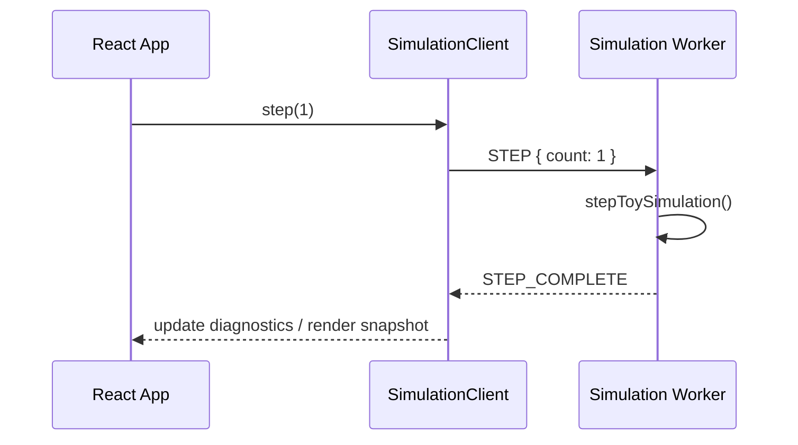

# Data Flow

**Living document** — update when message protocols, snapshots, or save formats change.

---

## 1. UI → worker command flow

```text
  App (React)
      │
      │  SimulationClient.step(1)
      ▼
  postMessage({ type: 'STEP', count: 1 })
      │
      ▼
  simulation.worker.ts
      │
      │  stepToySimulation(snapshot)
      ▼
  updated WorldSnapshot (authoritative)
```

**Plain English:** The visible app never edits simulation numbers directly. It sends named commands (`INIT`, `STEP`, `GET_SNAPSHOT`, `GET_DIGEST`, `LOAD_SNAPSHOT`) to the worker. The worker is the only code path that advances simulation truth.

**M01 update — real-time pacing (ARCH-005):** the periodic `STEP` is now driven by `SimulationDriver` on the main thread. Each animation frame it converts elapsed real time × the selected speed (Pause, 0.25×, 1×, 5×, 20×, 100×, 1000×) into whole simulated minutes via the pure `accumulateSimMinutes`, then posts `STEP { count }`. Because state depends only on the total minutes stepped, 1× and 1000× reach the same world for the same simulated duration.

```text
requestAnimationFrame → accumulateSimMinutes(pacing, elapsedMs, speed)
    → STEP { count }  (count = 0 while paused)
```

**Mermaid equivalent:**



---

## 2. Worker → render snapshot flow

```text
  WorldSnapshot (full, worker-only)
      │
      │  toRenderSnapshot()
      ▼
  RenderSnapshot { simMinute, visualPhase, tickCount,
                   calendar (derived), timeOfDay, isDaytime, … }
      │
      │  postMessage STEP_COMPLETE
      ▼
  Zustand diagnostics store
      │
      ├──► DiagnosticsHud (text panel)
      └──► Scene / WorldPlaceholder (3D rotation)
```

**Plain English:** The 3D scene and HUD receive a **small, read-only summary**. They cannot see PRNG internals, full event logs, or future NPC minds. If the renderer lags or unmounts, simulation truth in the worker is unchanged (ARCH-002).

**M01 update — derived calendar:** `toRenderSnapshot` runs `deriveCalendar(simMinute)` so the snapshot carries the human date/clock/season plus `timeOfDay` (drives day/night lighting) and `isDaytime`. The calendar is derived, never stored, so it cannot drift from the authoritative counter and never enters the save digest. The static town geometry (`src/world/townLayout.ts`) is authored content read directly by the renderer, not streamed per frame (ADR-006).

**M02 update — citizens in render snapshot:** `toRenderSnapshot` maps each `CitizenState` to a `RenderCitizen` (position, action, needs, appearance, selection flag). When a citizen is selected, `inspectorTrace` carries the read-only `lastUtilityTrace` for the God inspector panel. The renderer never receives full utility candidate lists for unselected citizens.

---

## 3. Simulation authority

```text
         ┌─────────────────────┐
         │   AUTHORITATIVE      │
         │   Web Worker         │
         │   - WorldSnapshot    │
         │   - PRNG state       │
         │   - Domain events    │
         └──────────┬──────────┘
                    │
      ┌─────────────┼─────────────┐
      │             │             │
      ▼             ▼             ▼
  RenderSnapshot  SaveBundle   Digest (tests)
  (display)       (export)     (fingerprint)
```

**Plain English:** One source of truth. Display, saves, and test fingerprints are **derived** from worker state, never the other way around.

---

## 4. Seeded randomness flow

```text
  worldSeed (string)
      │
      ▼
  hashSeedToUint32()
      │
      ▼
  Mulberry32Prng internal state (uint32)
      │
      ├──► toy step: weightedChoice, int, nextFloat
      │
      └──► snapshot.prng { algorithm, state }
              │
              ▼
           save bundle / restore / branch copy (future)
```

**Plain English:** “Random” choices in the simulation are reproducible. The seed starts the sequence; the PRNG state must be saved and restored so mid-game loads and future timeline branches stay fair.

**Invariant:** Never use browser `Math.random()` for simulation outcomes (ARCH-003).

---

## 5. Event creation flow

```text
  stepWorldSimulation()
      │
      ├──► stepCitizens() — needs decay, travel advance, utility decisions
      │
      ├──► stepToySimulation() — toy counter (M00 regression)
      │
      └──► createDomainEvent({ type: 'CITIZEN_ACTION_SELECTED', … })
              │
              ▼
           append to snapshot.events[]
```

**Plain English:** When something meaningful changes, the worker appends a **domain event** — a structured log entry with id, simulation time, type, and payload. M00 emits `TOY_STEP` per toy tick. M02 emits `CITIZEN_ACTION_SELECTED` when a citizen begins a new action (including travel). We do **not** log every graphics frame.

**Init event:** `TOY_WORLD_INITIALIZED` at simMinute 0 records world creation.

---

## 5b. M02 citizen stepping flow

```text
  stepCitizen(state, simMinute, prng)
      │
      ├──► decayNeedsForMinute()
      │
      ├──► if activeAction.kind === 'travel'
      │         advance along pathNodeIds → arrive at facility entrance
      │         → buildIndoorAction(followUpAction)
      │
      ├──► elif action duration complete
      │         applyNeedSatisfaction() → planNextAction()
      │
      └──► elif reflex need (Layer 1) interrupts non-sleep action
                planNextAction() with reflex candidate

  planNextAction()
      │
      ├──► Layer 1: reflex threshold breached → urgent action
      │
      └──► Layer 2: score all candidates (need, goal, travel, time, noise)
                → select highest → travel or indoor action
                → store UtilityTrace on citizen.lastUtilityTrace
```

**Plain English:** Each simulated minute, Alex's needs drift. If traveling, position advances along the A* path. When an action finishes, the utility planner scores candidates and picks the best. Urgent needs (bladder, thirst, hunger, exhaustion) bypass normal scoring via Layer 1. The full score breakdown is saved for the inspector.

---

## 5c. M02 citizen selection / inspector flow

```text
  UI click CitizenMesh
      │
      │  SimulationClient.selectCitizen(id)
      ▼
  postMessage({ type: 'SELECT_CITIZEN', citizenId })
      │
      ▼
  worker updates selectedCitizenId
      │
      │  toRenderSnapshot(snapshot, selectedCitizenId)
      ▼
  postMessage({ type: 'INSPECTOR_UPDATED', renderSnapshot })
      │
      ▼
  CitizenInspector reads inspectorTrace + needs from snapshot
```

**Plain English:** Clicking a citizen sends a selection command to the worker. The worker marks which citizen is selected and returns an updated render snapshot. The inspector panel shows need bars and the utility score breakdown from the last decision — it never computes scores itself.

---

## 6. Save / export / restore flow

```text
  WorldSnapshot (worker)
      │
      │  GET_SNAPSHOT or test helper
      ▼
  buildSaveBundle()
      │
      ├──► Zod validation (saveBundleSchema)
      ├──► digestCanonical(payload)
      └──► JSON string
              │
              ├──► save-baseline.json (review bundle)
              │
              └──► parseSaveBundle() → restoreSnapshotFromBundle()
                        │
                        │  LOAD_SNAPSHOT
                        ▼
                   worker continues stepping
```

**Plain English:** Saving means packaging worker state into versioned JSON, computing a fingerprint, and validating shape. Loading means parsing JSON, validating, and handing the snapshot back to the worker — which resumes as if time had paused. M00 does not replay events from an empty snapshot; it restores the full snapshot directly. Event replay architecture is reserved for later milestones.

**Digest payload fields (canonical order via sorted keys):**

- `schemaVersion`, `worldSeed`, `branchId`, `clock`, `prng`, `toy`, `eventIds`
- M02 adds citizen summary fields to digest when present (see `worldDigest.ts`)

**M02 save boundary:** `citizens[]` is optional in schema `m02.1`. Restoring a save with citizens rehydrates full citizen state including `activeAction`, `needs`, `workMinutesToday`, and `lastUtilityTrace`. M00 golden digest regression still pins literal `m00.1` without citizens.

---

## 7. Canonical digest flow (testing)

```text
  WorldSnapshot
      │
      ▼
  digestWorldSnapshot()
      │
      ├──► canonicalize (sort all object keys)
      └──► FNV-1a 32-bit → hex string
              │
              ▼
           compare across runs / saves
```

**Plain English:** Tests prove two runs match by comparing a short hash. Keys are sorted before hashing so property order never affects the result.

**M00 canonical value:** seed `GODMODE_M00_CANONICAL_2026`, 100 steps → digest `fac095d1`.

---

## Message protocol reference

### Requests (main → worker)

| Type | Purpose |
|------|---------|
| `INIT` | Create world from seed |
| `STEP` | Advance N simulated minutes |
| `GET_SNAPSHOT` | Export full `WorldSnapshot` |
| `GET_DIGEST` | Export fingerprint |
| `LOAD_SNAPSHOT` | Replace worker state from save |
| `SELECT_CITIZEN` | Set inspector target citizen (M02) |

### Responses (worker → main)

| Type | Purpose |
|------|---------|
| `READY` | Init complete |
| `STEP_COMPLETE` | Includes `RenderSnapshot` + step timing |
| `SNAPSHOT` | Full snapshot |
| `DIGEST` | Fingerprint string |
| `INSPECTOR_UPDATED` | Render snapshot after citizen selection (M02) |
| `ERROR` | Failure message |

Types live in `src/simulation/messages.ts`.

---

## What is intentionally not in M02 data flow

- UI commands that patch citizen fields directly
- Renderer → worker state writes
- Branch fork execution
- Event log replay from checkpoint-only storage
- Network sync or cloud saves

See `Docs/milestones/M00/KNOWN_LIMITATIONS.md`.
