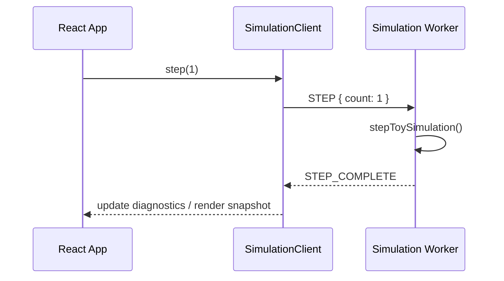

# Data Flow

**Living document** — update when message protocols, snapshots, or save formats change.

---

## 1. UI → worker command flow

```text
  App (React)
      │
      │  SimulationClient.step(1)
      ▼
  postMessage({ type: 'STEP', count: 1 })
      │
      ▼
  simulation.worker.ts
      │
      │  stepToySimulation(snapshot)
      ▼
  updated WorldSnapshot (authoritative)
```

**Plain English:** The visible app never edits simulation numbers directly. It sends named commands (`INIT`, `STEP`, `GET_SNAPSHOT`, `GET_DIGEST`, `LOAD_SNAPSHOT`) to the worker. The worker is the only code path that advances simulation truth.

**Mermaid equivalent:**



---

## 2. Worker → render snapshot flow

```text
  WorldSnapshot (full, worker-only)
      │
      │  toRenderSnapshot()
      ▼
  RenderSnapshot { simMinute, visualPhase, tickCount, … }
      │
      │  postMessage STEP_COMPLETE
      ▼
  Zustand diagnostics store
      │
      ├──► DiagnosticsHud (text panel)
      └──► Scene / WorldPlaceholder (3D rotation)
```

**Plain English:** The 3D scene and HUD receive a **small, read-only summary**. They cannot see PRNG internals, full event logs, or future NPC minds. If the renderer lags or unmounts, simulation truth in the worker is unchanged (ARCH-002).

---

## 3. Simulation authority

```text
         ┌─────────────────────┐
         │   AUTHORITATIVE      │
         │   Web Worker         │
         │   - WorldSnapshot    │
         │   - PRNG state       │
         │   - Domain events    │
         └──────────┬──────────┘
                    │
      ┌─────────────┼─────────────┐
      │             │             │
      ▼             ▼             ▼
  RenderSnapshot  SaveBundle   Digest (tests)
  (display)       (export)     (fingerprint)
```

**Plain English:** One source of truth. Display, saves, and test fingerprints are **derived** from worker state, never the other way around.

---

## 4. Seeded randomness flow

```text
  worldSeed (string)
      │
      ▼
  hashSeedToUint32()
      │
      ▼
  Mulberry32Prng internal state (uint32)
      │
      ├──► toy step: weightedChoice, int, nextFloat
      │
      └──► snapshot.prng { algorithm, state }
              │
              ▼
           save bundle / restore / branch copy (future)
```

**Plain English:** “Random” choices in the simulation are reproducible. The seed starts the sequence; the PRNG state must be saved and restored so mid-game loads and future timeline branches stay fair.

**Invariant:** Never use browser `Math.random()` for simulation outcomes (ARCH-003).

---

## 5. Event creation flow

```text
  stepToySimulation()
      │
      ├──► PRNG draws choice + increment
      │
      ├──► update ToySimState counters
      │
      └──► createDomainEvent({ type: 'TOY_STEP', … })
              │
              ▼
           append to snapshot.events[]
```

**Plain English:** When something meaningful changes, the worker appends a **domain event** — a structured log entry with id, simulation time, type, and payload. M00 emits one event per toy step. Later milestones emit events for purchases, conversations, deaths, etc. We do **not** log every graphics frame.

**Init event:** `TOY_WORLD_INITIALIZED` at simMinute 0 records world creation.

---

## 6. Save / export / restore flow

```text
  WorldSnapshot (worker)
      │
      │  GET_SNAPSHOT or test helper
      ▼
  buildSaveBundle()
      │
      ├──► Zod validation (saveBundleSchema)
      ├──► digestCanonical(payload)
      └──► JSON string
              │
              ├──► save-baseline.json (review bundle)
              │
              └──► parseSaveBundle() → restoreSnapshotFromBundle()
                        │
                        │  LOAD_SNAPSHOT
                        ▼
                   worker continues stepping
```

**Plain English:** Saving means packaging worker state into versioned JSON, computing a fingerprint, and validating shape. Loading means parsing JSON, validating, and handing the snapshot back to the worker — which resumes as if time had paused. M00 does not replay events from an empty snapshot; it restores the full snapshot directly. Event replay architecture is reserved for later milestones.

**Digest payload fields (canonical order via sorted keys):**

- `schemaVersion`, `worldSeed`, `branchId`, `clock`, `prng`, `toy`, `eventIds`

---

## 7. Canonical digest flow (testing)

```text
  WorldSnapshot
      │
      ▼
  digestWorldSnapshot()
      │
      ├──► canonicalize (sort all object keys)
      └──► FNV-1a 32-bit → hex string
              │
              ▼
           compare across runs / saves
```

**Plain English:** Tests prove two runs match by comparing a short hash. Keys are sorted before hashing so property order never affects the result.

**M00 canonical value:** seed `GODMODE_M00_CANONICAL_2026`, 100 steps → digest `fac095d1`.

---

## Message protocol reference (M00)

### Requests (main → worker)

| Type | Purpose |
|------|---------|
| `INIT` | Create world from seed |
| `STEP` | Advance N toy ticks |
| `GET_SNAPSHOT` | Export full `WorldSnapshot` |
| `GET_DIGEST` | Export fingerprint |
| `LOAD_SNAPSHOT` | Replace worker state from save |

### Responses (worker → main)

| Type | Purpose |
|------|---------|
| `READY` | Init complete |
| `STEP_COMPLETE` | Includes `RenderSnapshot` + step timing |
| `SNAPSHOT` | Full snapshot |
| `DIGEST` | Fingerprint string |
| `ERROR` | Failure message |

Types live in `src/simulation/messages.ts`.

---

## What is intentionally not in M00 data flow

- UI commands that patch citizen fields directly
- Renderer → worker state writes
- Branch fork execution
- Event log replay from checkpoint-only storage
- Network sync or cloud saves

See `Docs/milestones/M00/KNOWN_LIMITATIONS.md`.
