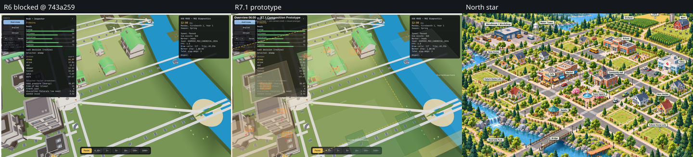
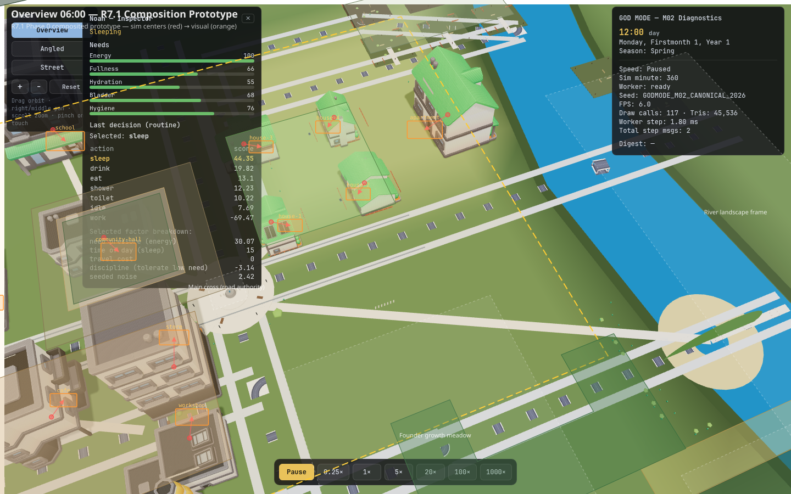
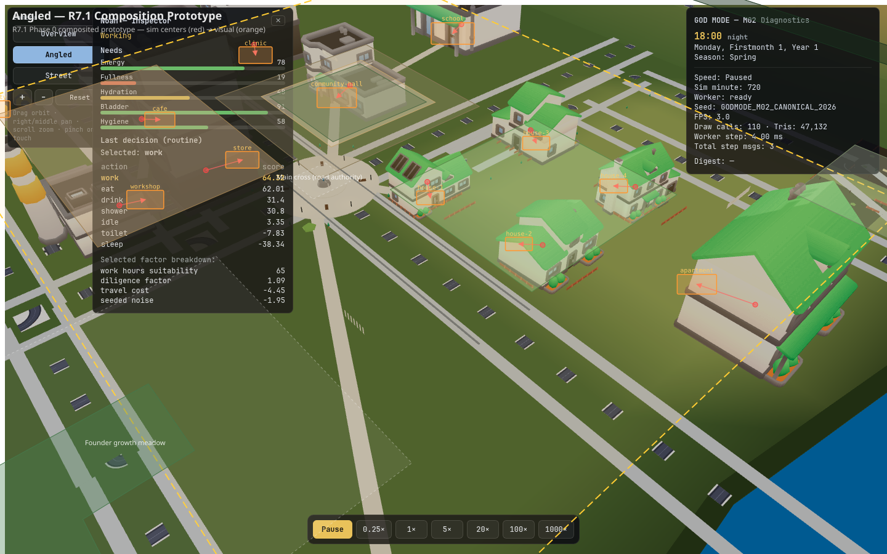

# WF02 R7.1 Composition Prototype (Phase 0)

**State:** PHASE_0_COMPLETE — **STOP** for ChatGPT prototype decision  
**Plan:** `PLAN_R7_1.md` (APPROVED_TO_BUILD scope: Phase 0 only)  
**Base evidence:** R6 `@743a259` — `review-evidence-wf02-r6-743a259`  
**Cameras frozen:** Overview `[10,93,54]→[30,2,4]`, Angled `[68,53,37]→[28,3,2]`, 1440×900, FOV 45°

---

## 1. Phase 0 deliverables

| Artifact | Path | Status |
|---|---|:---:|
| Kenney inventory audit | [`KENNEY_INVENTORY_AUDIT_R71.md`](KENNEY_INVENTORY_AUDIT_R71.md) | ✅ |
| Visual layout audit (JSON) | [`visual_layout_audit_r71.json`](visual_layout_audit_r71.json) | ✅ |
| Hero-core map (SVG) | [`composition_map_r71.svg`](composition_map_r71.svg) | ✅ |
| R6 failure overlay (SVG) | [`r6_failure_overlay_r71.svg`](r6_failure_overlay_r71.svg) | ✅ |
| **Composited Overview prototype** | [`prototype_overview_r71.png`](prototype_overview_r71.png) | ✅ |
| **Composited Angled prototype** | [`prototype_angled_r71.png`](prototype_angled_r71.png) | ✅ |
| Compare strip (R6 / prototype / north-star) | [`compare_r6_prototype_northstar_r71.png`](compare_r6_prototype_northstar_r71.png) | ✅ |
| Phase 0 manifest | [`phase0_manifest_r71.json`](phase0_manifest_r71.json) | ✅ |

**Regenerate:** `npm run phase0:wf02-r71`

**Phase 0 imports:** **0** files — zero asset/network errors.

---

## 2. Pixel-composited prototypes (authoritative Phase 0 evidence)

Composited by projecting world-space envelopes + visual building footprints onto frozen-camera R6 frames (`scripts/wf02-r71-prototype-composite.mjs`).

| Panel | Image | Method |
|---|---|---|
| R6 base | R6 `01_wf02_overview_dawn.png` / `02_wf02_angled.png` | Unmodified render @ `743a259` |
| Overlay | Semi-transparent district envelopes, void labels, auth→visual shift arrows | Three.js camera projection @ frozen presets |
| North star | `Docs/art-direction/references/god-mode-town-north-star.png` | Reference strip panel |

### Compare strip

### Overview 06:00 prototype

**Legend on image:** yellow dashed = hero core (~120 m); warm fill = civic plaza + commercial frontage; green fills = residential/orchard/park/periphery; white dashed = designed voids; red dot = auth sim center; orange box = proposed visual footprint; red arrow = presentation shift.

### Angled prototype

---

## 3. Hero core read (~100–140 m inhabited visual core)

| Zone | World bounds (x, z) | Screen role @ Overview | Read |
|---|---|---|---|
| **Hero core** | x ∈ [−55, 55], z ∈ [−55, 35] | ~70% of settlement mass | Dense miniature town — civic + commercial + residential |
| **Mid landscape** | z ∈ [35, 65], river edge | Transition | Park U-frame, farm approach |
| **Outer authored** | z > 65, periphery z < −70 | Background | Orchard block, forest wall, expansion meadow |

**Design intent:** Normal viewer sees a **coherent inhabited core** first; outer 240 m board reads as **farm / forest / river / expansion** — not unused green board.

---

## 4. Designed void catalog (no quota — pixel decides)

| Void ID | Treatment | Purpose @ 06:00 |
|---|---|---|
| **founder-meadow** | Warm grass + sparse edge trees only | Room-to-grow — intentional, not abandoned |
| **main-cross** | Road/sidewalk authority clear | Civic/commercial spine readable |
| **river-corridor** | Water + bank vegetation frame | Landscape edge, not empty board |
| **expansion-east** | Meadow + distant tree accents | Future growth beyond hero core |

Each void is labeled on the composited Overview prototype.

---

## 5. Fourteen-facility visual mapping (sim truth untouched)

**Rule:** `facilityPoints.ts` / M02 logical entrances unchanged. Presentation uses `visualCenter` + frozen `targetWidth`. Attachments derive from visual transform in Phase 1.

| Facility | Auth (x,z) | Visual (x,z) | Δ m | maxM | Pass |
|---|---|---|---:|---:|:-:|
| community-hall | (−18,−18) | (−16,−14) | 4.5 | 6 | ✅ |
| clinic | (−42,−14) | (−38,−12) | 4.5 | 6 | ✅ |
| school | (−24,−48) | (−22,−44) | 4.5 | 6 | ✅ |
| house-1 | (11,−10) | (14,−8) | 3.6 | 4 | ✅ |
| house-2 | (30,−12) | (28,−10) | 2.8 | 4 | ✅ |
| house-3 | (11,−30) | (14,−28) | 3.6 | 4 | ✅ |
| house-4 | (30,−30) | (28,−28) | 2.8 | 4 | ✅ |
| apartment | (52,−22) | (46,−20) | 6.3 | 8 | ✅ |
| store | (−11,11) | **(−10,6)** | 5.1 | **5.5** | ✅ |
| cafe | (−30,12) | (−28,10) | 2.8 | 5 | ✅ |
| workshop | (−11,23) | **(−10,20)** | 3.2 | 5 | ✅ |
| warehouse | (−38,48) | (−36,42) | 6.3 | 8 | ✅ |
| utility | (−52,30) | (−48,28) | 4.5 | 8 | ✅ |
| farmhouse | (28,82) | (32,68) | 14.6 | 16 | ✅ |

**Store adjustment:** `maxM` raised to **5.5 m** (from 4 m) so visual compression preserves store↔workshop AABB gap ≥ 0.10 m.

### M02 plausibility (presentation AABB audit)

| Check | Value | Gate |
|---|---|---|
| Sim entrances frozen | house-1 (11,−7.6), store (−11,7.6), workshop (−11,20.2) | ✅ unchanged |
| Store↔workshop visual AABB gap (Z) | **0.52 m** | ✅ ≥ 0.10 m |
| All offsets within maxM | 14/14 | ✅ |

Machine-readable: [`visual_layout_audit_r71.json`](visual_layout_audit_r71.json)

---

## 6. Perceptual hierarchy @ frozen cameras

### Overview 06:00 — 1st / 2nd / 3rd read

| District | 1st | 2nd | 3rd |
|---|---|---|---|
| **Civic** | Warm plaza pad + hall mass | Dark colonnade ring | Main cross opening |
| **Commercial/work** | Store/cafe frontage band | Workshop/warehouse silhouettes | Tree/prop accents |
| **Residential** | Hedge-enclosed block (4 houses clustered) | Street-tree corridor | Future-lot prepared row |
| **Farm/orchard** | Solid dark-green orchard rectangle | Straw field band | Farmhouse (visual @ 32,68) |
| **River/park** | U-frame west of park | River blue edge | Bridge |
| **Periphery** | Dark north forest wall | West depth | NE accents |

### Angled — emphasis shift

Foreground civic/commercial spine → mid residential cluster → background orchard/farmhouse pull-in.

---

## 7. Presentation vertical layering decision

| Item | Decision |
|---|---|
| **Selected for Phase 1?** | **Yes** — modest presentation-only tiers |
| **Mechanism** | `PresentationTerrainLayer` embankment skirts (0.15–0.8 m) + CVP retaining edges at envelope boundaries |
| **Sim terrain** | **Unchanged** — `terrainHeightAt` authority frozen |
| **Rollback** | Remove `PresentationTerrainLayer` from orchestrator; revert CVP height constants |
| **Prototype evidence** | Civic embankment band shown in composited Overview (tan overlay, west of cross) |

**Rationale:** R6 CVP mounds at y ≈ 0.08–0.35 m merged with meadow vertex color. Raised presentation tiers escape flat-board read without touching simulation geography.

---

## 8. Asset vocabulary (Phase 0a audit)

| Metric | Result |
|---|---|
| On-disk Kenney GLBs | **29** (all registered, 0 missing) |
| Phase 0 imports | **0** |
| Gap props on disk | **None** (bench/fountain/lamp not present) |

**Phase 2+ candidates** (mocked in composited pixels only — see [`KENNEY_INVENTORY_AUDIT_R71.md`](KENNEY_INVENTORY_AUDIT_R71.md)):

- `detail-bench.glb`, `detail-fountain.glb`, `lamp-post.glb`, `path-round.glb`, `bush-large.glb` — Kenney CC0, single-file import only after ChatGPT approval row in `ASSET_REGISTER.md`.

---

## 9. Prototype performance ledger

**R6 baseline preserved (do not spend because it exists):**

| Preset | DC | Tris |
|---|---:|---:|
| Overview 06:00 | 117 | 45,536 |
| Overview 12:00 | 120 | 45,872 |

**Estimated Phase 1 additive cost (if prototype approved):**

| Option | Δ DC | Δ tris | Cumulative est. Overview |
|---|---:|---:|---|
| A — VisualTownLayout reposition | 0 | 0 | ~117 DC / ~46k tris |
| B — Hero-core envelope fills | +6…+12 | +18k…+35k | ~123 DC / ~65–80k tris |
| C — Presentation vertical layer | +1…+2 | +4k…+10k | +2 DC / +7k tris |
| D — Curated props (≤24 inst.) | +1…+2 | +2k…+6k | +2 DC / +4k tris |
| **Target gate** | **≤125** (hard ≤135) | **≤100k** (hard ≤118k) | M03 reserve ≥5 DC / ≥8k tris |

Full ledger: [`phase0_manifest_r71.json`](phase0_manifest_r71.json)

---

## 10. Prototype assessment (builder — not milestone PASS)

| Criterion | Prototype verdict |
|---|---|
| Unmistakable delta vs R6 @ Overview | **Promising** — hero core density, envelope hierarchy, void labels visible |
| North-star family resemblance | **Partial** — direction correct; full resemblance needs Phase 1 engine renders + optional Kenney detail imports |
| Sim authority preserved | **Yes** — mapping table + M02 gap audit pass |
| Flat-board escape | **Requires** vertical layer (§7) + envelope fills in Phase 1 |

### If prototype insufficient for ChatGPT approval

Minimum constraint relaxations to recommend (in order):

1. **Curated Kenney detail import** (fountain + bench + lamp) — civic/commercial identity
2. **Farmhouse maxOffsetM** up to 18 m — stronger farm pull into mid-background
3. **Hero core bounds** tighten to x ∈ [−50, 50], z ∈ [−50, 30] — further compress spread

---

## 11. Phase 0 STOP

**No production code implemented.** `VisualTownLayout.ts`, asset imports, and broad world changes are **not** built.

Awaiting ChatGPT prototype decision:

| Decision | Next step |
|---|---|
| `APPROVED_TO_BUILD` (Phase 1) | Implement `VisualTownLayout` + envelope fills per prototype |
| `PLAN_CHANGES_REQUIRED` | Revise plan; re-run Phase 0 |
| `CONSTRAINT_RELAXATION_REQUIRED` | Name constraint; do not proceed to Phase 1 |

---

**Generated by:** `npm run phase0:wf02-r71`  
**Scripts:** `scripts/wf02-r71-kenney-inventory-audit.mjs`, `scripts/wf02-r71-visual-layout-audit.mjs`, `scripts/wf02-r71-prototype-composite.mjs`
