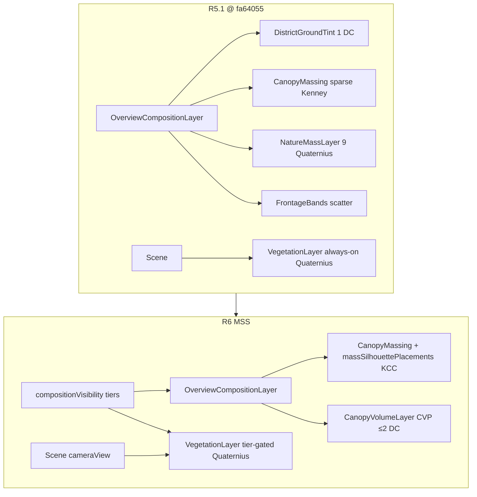

# WF02 Plan Revision 6 — Mass Representation Redesign (Low-Cost Screen-Space Silhouettes)

**State:** APPROVED_TO_BUILD (implemented — awaiting Grok review)  
**Supersedes:** Plan revision 5.1 (`Docs/milestones/WF02/PLAN_R5_1.md`)  
**Investigation base SHA:** `fa64055444bd9644f28fbe467747ec85b5d901ab` (WF02-004 blocked @ R5.1)  
**Branch:** `cursor/wf02-scale-calibration-754a`  
**Scope:** PLAN ONLY — no production code, asset import/repack, or evidence capture until `[GOD-MODE:CHATGPT-PLAN-DECISION] Decision: APPROVED_TO_BUILD`

---

## 1. Work item

WF02 — North-Star Scale & Aesthetic Calibration (presentation-only; simulation/geography frozen).

---

## 2. Decision context

| Review | SHA | Gate | Lesson |
|---|---|---|---|
| WF02-003 (R4.1) | `6dbd8b5` | BLOCKED | Orchestrator correct; Kenney scatter + faint tints insufficient |
| WF02-004 (R5.1) | `fa64055` | BLOCKED | **4th consecutive visual hard-gate failure** — spent Overview DC ceiling for 9 high-poly Quaternius instances; orchard/park tiers empty; atlas hue cannot fill terrain/road void |
| ChatGPT FIX_REQUIRED | `fa64055` | Plan R6 required | Change **representation of mass**, not instance count or color tuning |

**Engineering preserved @ `fa64055`:** 162/162 tests PASS, 7/7 e2e PASS, zero asset/network errors, `facilityPoints.ts` frozen, determinism intact.

**Measured performance @ `fa64055` (live GL after frame settle — builder + Grok reconcile):**

| Preset | Draw calls | Triangles | Gate |
|---|---:|---:|---|
| Overview 06:00 | **137** | **130,549** | ≤140 DC ✅ but **no reserve** |
| Overview 12:00 | **140** | **130,885** | **at ceiling** |
| Street | **77** | **98,183** | ≤100 DC ✅ |

---

## 3. Executive summary — R6 authorized build path

R6 is **not** a fifth scatter/tint/lighting iteration. It replaces overview-readable vegetation/public-space mass with **low-cost grouped presentation primitives** that occupy previously empty pixels at **≤1 draw call per shared batch**.

### Build Path P-MSS (Mass Silhouette System — mandatory)

| Layer | R5.1 (failed) | R6 (authorized) |
|---|---|---|
| Overview nature | 9 individual Quaternius trees (+ empty orchard/park tiers) | **Kenney Canopy Clusters (KCC)** — dense `treeSmall`/`treeLarge` instancing + **Canopy Volume Primitives (CVP)** — shared low-poly merged geometry blobs |
| DC strategy | Lived at 137–140 DC with weak visual payoff | **Recover headroom first** → target **≤130 DC** post-Phase-A → finish **≤135 DC** with **≥5 DC reserve** |
| Orchard/park heroes | `ORCHARD_PERIMETER` / `PARK_RIVER_ARC` = `[]` | **Mandatory non-empty** placement tables + exclusion rules (§8) |
| Atlas | Warm repack shipped | **Frozen** — audit pixels only; no further hue-only revision unless tied to measured district readability failure |
| Quaternius on Overview | Always-on baseline + NatureMassLayer | **Tier-gated to Street/M02/attachment presets only** on Overview/Angled |

**Rejected without new plan revision:** another Quaternius scatter layer, global scale/camera change, phantom lot buildings, new building asset family, evidence-only render branches, geometric frustum culling diverging from gameplay path, runtime LLM/API.

---

## 4. Root cause — why R5.1 failed (implementation vs approved plan)

| Approved R5.1 intent | Shipped @ `fa64055` | Visual outcome |
|---|---|---|
| 26 Quaternius across T1–T4 tiers | **9** (5 district + 4 periphery) | Individual dots, not mass |
| Orchard perimeter 4× pine + Kenney grid | **`ORCHARD_PERIMETER = []`** | Farm reads as sparse grid + void |
| Park river arc 4× mixed | **`PARK_RIVER_ARC = []`** | Park/river edge still thin |
| Recovery-before-add → ≤138k / ~130 DC | **130,885 tris / 140 DC** | Budget spent; reserve gone |
| Warm atlas moves emotional family | Palette local to 14 buildings | **Dominant screen = terrain/roads/void** |

**Fundamental failure:** four revisions retained the same **occupied-vs-empty image-space**. High-poly Quaternius instances have poor **image-space-value / DC cost** at Overview distance. Atlas hue cannot compensate for missing canopy/orchard/park/frontage **volume**.

---

## 5. Preserved (frozen — do not revert or touch)

Same as R5.1 §4:

- `src/world/facilityPoints.ts`, `src/simulation/**`, authoritative `LOCATIONS`
- M02 trio (`house-1`, `store`, `workshop`) centers, entrances, routes
- Road topology, river carve, `TownLandscape` height authority (vertex bands may extend **colors only**)
- R2 `targetWidth` for all 14 facilities; 2.32 m presentation / 1.8 m simulation citizen
- `modelLayout` / manifest / presentation anchor authority
- Overview camera `[10,93,54]→[30,2,4]`, Angled `[68,53,37]→[28,3,2]`
- Determinism, seeded RNG, no M03 population gameplay, no runtime LLM

**Preserve from R5.1 engineering (do not discard):**

- `OverviewCompositionLayer` single orchestrator pattern
- `compositionVisibility.ts` preset-tier gating (extend tiers, do not replace with frustum culling)
- Warm atlas repack @ `_archive/pre-r5/` (frozen — no further repack unless audit fails §12)
- `compositionMask.ts` exclusion corridors
- Green test suite + evidence hygiene scripts (extend for R6 chain)

---

## 6. Explicit 14-building silhouette limitation

The registered **14 Kenney facility GLBs** are the only building silhouettes. They cannot fill ~45% of Overview frame without violating “no phantom buildings.” R6 **does not** import another building family.

**Plan acknowledgment:** Civic/residential/commercial **identity at Overview** must come from **canopy framing, garden blocks, frontage mass, and warm atlas differentiation** — not additional building footprints. If north-star density still exceeds what 14 facilities + MSS can achieve, that gap is documented as a **product scope ceiling** for WF02, not an excuse to add fake structures.

---

## 7. District-by-district screen-space mass budget

Targets @ Overview 06:00, 1440×900, frozen camera. **Coverage = approximate % of non-sky pixels** that must read as intentional mass (canopy, garden, orchard block, park lawn, hedge-enclosed volume) vs bare terrain/road.

| District | R5.1 occupied read | R6 target occupied | Dominant new shapes | Shared batch(es) | Est. new instances | Est. Δ DC |
|---|---|---:|---|---|---|---:|
| **A. Civic / commercial core** | Sparse plaza + 4 Kenney trees | **~18%** | Plaza canopy ring + commercial street-tree line + corner volume blobs | KCC `treeLarge` ring; CVP `canopyDome` civic; existing `CommercialStreetLife` | +12 treeLarge, +10 CVP | +1 CVP |
| **B. Residential + future lots** | Hedges + faint ground tint | **~16%** | 4 hedge-enclosed garden masses + street tree pairs | CVP `canopyDome` residential ×4; KCC `treeSmall` street line; `ResidentialHedges` (keep) | +8 treeSmall, +32 CVP | +1 CVP |
| **C. Future lots (8)** | Fence corners only | **~6%** | Interior garden fill per lot (no buildings) | CVP `gardenMound` ×8 clusters | +24 CVP | 0 (shared material) |
| **D. Farm / orchard hero** | 4×5 Kenney grid (too sparse) | **~10%** | **Dual canopy blocks** + field band + farmhouse frame | KCC 8×6 `treeSmall` + perimeter `treeLarge`; CVP `fieldBand` rows | +28 treeSmall, +8 treeLarge, +20 CVP | +0–1 KCC |
| **E. River / park edge** | 4 park Quaternius (baseline only) | **~9%** | **Curved canopy arc** + promenade lawn mass | KCC `treeSmall` arc 18; CVP `canopyDome` park ×12 | +18 treeSmall, +12 CVP | +1 KCC |
| **F. Periphery frame** | 4 Quaternius edge trees | **~12% perimeter band** | North/west **forest wall** instanced strip | KCC `treeSmall`/`treeLarge` wall 36+12 | +48 treeSmall, +8 treeLarge | +0 KCC |
| **G. Growth void** | ~45% bare meadow | **~33%** structured negative space | Intentionally empty — smaller than R5.1 | — | — | 0 |

**Pixel acceptance is primary.** §7 targets are planning guides; §22 stop tests are authoritative.

---

## 8. Mandatory hero silhouettes — exact placements (non-empty)

All coordinates deterministic; no `Math.random`. Every placement passes `isOverlayExcluded()` from `compositionMask.ts` (roads, paths, river, square fountain). Additional rules per tier below.

### 8.1 Orchard hero — `ORCHARD_BLOCK` (replaces empty `ORCHARD_PERIMETER`)

**Anchor:** `CANONICAL_TOWN.farmPlots` id `farm-3` center **(55, 98)**.

| Batch | Function | Spec | Count | Exclusion |
|---|---|---|---:|---|
| KCC-A | Interior orchard grid | `buildOrchardGrid(center, 8, 6, 2.2, treeSmall)` | **≤48** (skip excluded cells) | `isOverlayExcluded`; min **2.0 m** from farm road centerline |
| KCC-B | Perimeter frame | 4 corners `treeLarge` @ (±16, ±14) offset from center; edge midpoints every 8 m | **8 treeLarge** | Same + min **3.0 m** from `farmhouse` presentation AABB |
| CVP-A | South field band | `buildFieldBandRows(center, 3 rows × 10 cols, spacing 2.8, yScale 0.35)` using `SCATTER_GEOM.fieldBand` | **30** | Exclude farm road; rows south of orchard grid only |

**Minimum shipped:** 40 Kenney treeSmall + 8 treeLarge + 30 field-band CVP. **Empty array forbidden.**

### 8.2 River / park hero — `PARK_RIVER_ARC` (replaces empty tier)

**Anchor:** park center **(72, 38)**; river east bank x ≈ **78–92**.

| Batch | Function | Spec | Count | Exclusion |
|---|---|---|---:|---|
| KCC-C | Canopy arc | `buildArcPlacements(parkCenter, radius 14, arc 140°, treeSmall, 18 slots)` along east/northeast | **18 treeSmall** | `isOverlayExcluded`; min **2.5 m** from river water polygon |
| CVP-B | Promenade lawn mass | `buildArcPlacements(parkCenter, radius 10, arc 120°, canopyDome, 12 slots, yScale 0.5)` | **12 CVP** | Same river margin; min **1.5 m** from park bench props |

**Minimum shipped:** 18 treeSmall + 12 CVP. **Empty array forbidden.**

### 8.3 Periphery forest wall — `PERIPHERY_FOREST_FRAME` (replace 4 Quaternius)

| Batch | Line | Spec | Count | Exclusion |
|---|---|---|---:|---|
| KCC-D | North wall | z = **−102**, x = −88…+88 step 4 m, `treeSmall` scale 1.1–1.25 | **24** | Skip if `isOverlayExcluded` |
| KCC-E | West wall | x = **−104**, z = −90…+70 step 5 m, mixed `treeSmall`/`treeLarge` | **16** | Skip excluded |
| KCC-F | NE accent | 4× `treeLarge` @ (92, −96), (98, −88), (95, 58), (100, 48) | **4** | Skip excluded |

**Minimum shipped:** 44 Kenney instances (0 Quaternius). **Removes all Quaternius from T4.**

### 8.4 Civic canopy ring — `CIVIC_COLONNADE` (extend existing Kenney in `districtMassing.ts`)

| Batch | Spec | Count |
|---|---|---:|
| KCC-G | `treeLarge` on radius **9.5 m** around square center **(0, 0)**, 12 equal angles | **12** |
| CVP-C | 8× `canopyDome` @ plaza quadrant corners (scale 1.2) | **8** |

### 8.5 District canopy restore — **delete Quaternius `DISTRICT_CANOPY_RESTORE`**

R6 **removes** the 5 Quaternius district placements. Residential/commercial reads come from KCC street lines + CVP garden blocks (§8.6).

### 8.6 Residential street tree line + garden blocks

| Batch | Spec | Count |
|---|---|---:|
| KCC-H | `treeSmall` along z = −18…−62 every 6 m, x = 14 and x = 48 (dual line) | **≤16** |
| CVP-D | 4 clusters × 8 `gardenMound` inside hedge rectangles around houses 1–4 | **32** |

---

## 9. Phase A — draw-call recovery (mandatory before mass add)

**Baseline:** Overview **137** DC / **130,549** tris @ `fa64055`.

Execute Phase A, **measure live GL**, and do not proceed to Phase B until Overview **≤130 DC** (stretch) or documented justification with **≥5 DC reserve** path to **≤135 DC** final.

| # | Removal / consolidation | Files | Est. Δ DC | Est. Δ tris | Rationale |
|---|---|---|---:|---:|---|
| A1 | **Remove `NatureMassLayer` Quaternius entirely** | `NatureMassLayer.tsx`, `natureMassPlacements.ts` | 0 | **−~22,000** | Poor image-space value; replaced by KCC |
| A2 | **Remove `DistrictGroundTint`** — terrain vertex bands carry district read | `DistrictGroundTint.tsx`, `districtMassing.ts` `groundZones` → `[]` | **−1** | **−~1,000** | Faint grid wash; costs 1 DC for little pixel gain |
| A3 | **Remove `FrontageBands` InstancedScatter** — frontage read from KCC + CVP | `FrontageBands.tsx`, `OverviewCompositionLayer.tsx` | **−1** | **−~360** | Decorative shrub dots ≠ mass |
| A4 | **Tier-gate `VegetationLayer` Quaternius** — Overview/Angled mount **zero** Quaternius; Street/M02/attachment presets keep M02 corridor + targeted accents | `VegetationLayer.tsx`, `compositionVisibility.ts` new `baselineVegetation` tier | **−2 to −4** | **−~18,000** | Stop paying high-poly cost at Overview |
| A5 | **Collapse CVP materials** — max **2** shared `MeshStandardMaterial` refs for all volume primitives | `CanopyVolumeLayer.tsx`, `DistrictPalette.ts` | 0 (Phase A) | 0 | Prepare +2 DC cap for all CVP |
| A6 | **Audit pass** — run extended `scripts/wf02-r6-dc-audit.mjs` (toggle layers, record DC) | new script | — | — | Measured truth replaces ledger fiction |

**Phase A expected total:** **−4 to −7 DC**, **−~40,000 tris** → Overview **~130–133 DC**, **~90,000–95,000 tris**.

**Gate:** If Phase A live GL still **>130 DC**, prune in order: (1) `CommercialStreetLife` prop groups audit, (2) `FutureLotPresentation` scatter audit, (3) civic CVP count −2 — **never** M02 corridor, orchard KCC, park arc, periphery wall first.

---

## 10. Phase B — mass representation implementation

### 10.1 New modules

| File | Responsibility |
|---|---|
| `src/rendering/environment/CanopyVolumeLayer.tsx` | Renders all CVP batches (civic, residential gardens, future lots, field bands, park promenade) via `InstancedScatter`; **≤2 DC** total |
| `src/rendering/environment/massSilhouettePlacements.ts` | Deterministic placement tables §8; exports `ORCHARD_BLOCK`, `PARK_RIVER_ARC`, `PERIPHERY_FOREST_FRAME`, `CIVIC_COLONNADE`, etc. |
| `src/rendering/environment/massSilhouetteBuilders.ts` | Pure functions: `buildArcPlacements`, `buildFieldBandRows`, `buildWallLine`, exclusion-aware grid expansion |
| `src/rendering/scatterGeometries.ts` | Add **`canopyDome`** (low-poly merged hemisphere ~24 tris), **`gardenMound`** (~18 tris), **`fieldBand`** (~8 tris) — module singletons |

### 10.2 Modified modules

| File | Change |
|---|---|
| `OverviewCompositionLayer.tsx` | Mount `CanopyVolumeLayer`; remove `NatureMassLayer`, `FrontageBands`, `DistrictGroundTint`; keep `CanopyMassing`, hedges, R3 modules |
| `CanopyMassing.tsx` | Consume expanded KCC tables from `massSilhouettePlacements.ts` + `districtMassing.ts` (single `InstancedGltfPlacements` pass) |
| `districtMassing.ts` | Replace sparse `kenneyTrees` array with calls to silhouette builders; `groundZones: []` |
| `compositionVisibility.ts` | Add `baselineVegetation` tier; remap orchard/park/periphery tiers to KCC+CVP (same preset lists) |
| `VegetationLayer.tsx` | Accept optional `cameraView`; gate Quaternius to non-Overview presets |
| `Scene.tsx` | Pass `cameraView` to `VegetationLayer` (same prop as composition layer) |
| `natureMassPlacements.ts` | **Deprecate** — re-export from `massSilhouettePlacements.ts` for test stability or delete with test migration |

### 10.3 Asset / batch inventory (R6 — no new URLs)

| Batch ID | Asset / geometry | URL or geom | Tris/instance | DC model |
|---|---|---|---:|---|
| KCC-small | Kenney tree | `/assets/glb/kenney/suburban/tree-small.glb` | 42 | 1 DC all instances |
| KCC-large | Kenney tree | `/assets/glb/kenney/suburban/tree-large.glb` | 42 | 1 DC shared with KCC-small group in same component = **+0 if same InstancedGltfPlacements** |
| CVP-warm | `canopyDome` / `gardenMound` | `SCATTER_GEOM.*` | 8–24 | **1 DC** shared material A |
| CVP-field | `fieldBand` | `SCATTER_GEOM.fieldBand` | 8 | **1 DC** shared material B |
| Hedges | Kenney fence | `fence-low.glb` | 180 | 1 DC (unchanged ≤48) |
| Buildings | 14 facilities | warm repack GLBs | unchanged | unchanged |
| Quaternius | M02/Street only | existing 10 glTFs | 600–3153 | **0 on Overview** after A4 |

**Quaternius Overview budget @ R6:** **0 instances visible** on Overview/Angled. Street/M02 presets retain existing corridor accents (≤16 instances).

---

## 11. Reconciled render budget (Phase A → Phase B)

### 11.1 Incremental ledger (measured unit costs)

| Unit | Tris/instance | DC |
|---|---:|---|
| Kenney treeSmall / treeLarge | 42 | 0 incremental (instanced) |
| CVP canopyDome | 24 | 1 per material (not per instance) |
| CVP gardenMound | 18 | shared |
| CVP fieldBand | 8 | shared |
| Quaternius commonTree1 (removed Overview) | 3,153 | — |

### 11.2 Phase totals (estimate — must measure)

| Phase | Overview DC | Overview tris | Notes |
|---|---:|---:|---|
| R5.1 @ `fa64055` | 137–140 | 130,549–130,885 | Failed visual gate |
| **After Phase A** | **≤130** (target) | **~90,000–95,000** | Mandatory measure gate |
| **After Phase B (+KCC+CVP)** | **≤135** (hard) | **~105,000–118,000** | +~170 Kenney + ~110 CVP ≈ +12k tris |
| **Reserve vs hard cap** | **≥5 DC** below 140 | **≥17k** below 150k | Do not plan to live at 140 |

| Preset | Visible @ R6 | Est. DC | Est. tris | Gate |
|---|---:|---:|---|
| Overview 06:00 | KCC all + CVP all + T0 core | **≤135** | **≤118,000** | ≤140 / <150k |
| Overview 12:00 | same | **≤135** | **≤118,500** | same |
| Angled | KCC periphery + park + orchard | **≤132** | **≤118,000** | info |
| Street | T0 + M02 Quaternius + partial KCC | **≤85** | **≤105,000** | ≤100 DC ⚠️ — if exceed, drop periphery KCC on street preset only |
| home/store/workshop-street | M02 corridor + attachments | **≤78** | **≤102,000** | ≤100 ✅ |

**Prune order if live GL exceeds gate:** (1) future-lot CVP −50%, (2) residential garden CVP −25%, (3) NE periphery accents −4, (4) civic CVP −2 — **never** orchard block, park arc, periphery north/west wall, M02 corridor.

### 11.3 Measurement protocol

1. `npm run build && npm run preview`
2. `node scripts/measure-render-budget.mjs` — extend to Overview dawn/noon + Angled + Street
3. `node scripts/wf02-r6-dc-audit.mjs` — layer toggle DC attribution
4. `npm run capture:wf02-evidence` — diagnostics on dawn/noon/street shots
5. **Do not hand off on ledger alone**

---

## 12. Warm atlas audit (preserve frozen — no hue-only revision)

**Action @ R6:** Side-by-side pixel compare @ Street + civic attachment presets **before any further atlas work**.

| Criterion | Pass | Fail action |
|---|---|---|
| M02 store/workshop door readable @ Street | contrast ≥ R4.1 audit | Document only — **no repack** unless Product Owner approves new plan |
| District differentiation @ mid distance | warm_residential vs warm_commercial discernible | Accept; do **not** block on subtle hue |
| Overview emotional warmth | MSS occupancy improves family read without atlas change | **Expected pass path** — atlas frozen |

**Rollback:** `_archive/pre-r5/` → canonical URLs (unchanged from R5.1 §7.3).

---

## 13. Data flow — before → after

**Authority:** `CANONICAL_TOWN` / `facilityPoints.ts` unchanged. All new tables live in presentation modules only; worker never reads tier gates.

---

## 14. Do-not-touch list

| Path | Reason |
|---|---|
| `src/world/facilityPoints.ts` | Sim anchor authority |
| `src/simulation/**` | WF02 presentation-only |
| `src/world/**` except presentation consumers | Geography frozen |
| M02 entrance coords / routes | M02 regression gate |
| R2 `targetWidth` / `modelLayoutManifest.json` facility widths | Scale frozen |
| Overview / Angled camera constants | Evidence chain |
| `public/assets/glb/kenney/_archive/pre-r5/**` | Rollback source |
| Import Quaternius Buildings / Kenney spare GLBs / phantom lot buildings | Asset policy |

---

## 15. Facility / door / road invariants (re-audit pre-READY)

Re-run `scripts/wf02-r41-audit.mjs` + overlap checks after Phase B:

- 14-facility scale table unchanged (R3/R4.1 widths)
- Store/workshop presentation AABB gap **≥0.10 m**; entrances `(11,-7.6)`, `(-11,7.6)`, `(-11,20.2)` visually honest
- KCC/CVP placements **≥1.5 m** from M02 entrance paths
- No mass primitive intersects road surface (z-fighting) — enforced by `isOverlayExcluded` + 0.35 m road margin
- Orchard field bands **do not** clip farm road or farmhouse pad

---

## 16. Tests (implementation)

| Test file | Coverage |
|---|---|
| `tests/unit/wf02/massSilhouettePlacements.test.ts` | **NEW** — orchard/park/periphery tables non-empty; min counts §8; determinism |
| `tests/unit/wf02/massSilhouetteBuilders.test.ts` | **NEW** — arc/wall/field builders respect `isOverlayExcluded` |
| `tests/unit/wf02/compositionVisibility.test.ts` | Extend — Overview excludes baseline Quaternius; orchard/park tiers |
| `tests/unit/wf01/districtComposition.test.ts` | Update if `natureMassPlacements` paths move |
| `tests/unit/wf02/compositionMask.test.ts` | Regression — road/river exclusions |
| `npm run test:all` | Must remain **162+ unit/integration + 7 e2e PASS** |

---

## 17. Evidence requirements (publish before READY_FOR_REVIEW)

**Hard rule:** GitHub release **published** before `[GOD-MODE:BUILDER]` handoff — not “to be published.”

### 17.1 Compare chain (same-view, frozen cameras)

| Panel | Source |
|---|---|
| WF01 BEFORE | release `review-evidence-wf01-builder-r5` |
| WF02 R4.1 | `review-evidence-wf02-r41-6dbd8b5` |
| WF02 R5.1 | `review-evidence-wf02-r51-fa64055` (builder release @ implementation SHA) |
| WF02 R6 | `review-evidence-wf02-r6-<sha>` |
| NORTH STAR | `Docs/art-direction/references/god-mode-town-north-star.png` |

Update `scripts/capture-wf02-evidence.mjs`:

- Add R5.1 URL to compare strip
- Embed exact builder SHA in manifest
- Reject stale overview filenames (retain R5.1 hygiene)
- **`assertReleasePublished()`** — fail capture if GitHub release tag missing

### 17.2 Required shots

Overview dawn + noon (diagnostics), Angled, civic, residential/future lots, commercial/work, farm/orchard hero, river/park hero, Street citizen+door+road, store/workshop, night, attachments, diagnostics manifest, compare HTML.

### 17.3 Zero-error proof

`consoleErrors: []`, `networkAssetErrors: []`, loader failures 0.

---

## 18. M03 headroom

WF02 R6 reserve (**≥5 DC / ≥17k tris** below Overview hard caps) is **incidental** only. Twenty citizens require separate LOD/culling/impostor strategy per `Docs/milestones/WF01/M03_HEADROOM.md`. **Do not** claim WF02 mass silhouettes satisfy M03 population rendering.

---

## 19. Rollback

| Step | Action |
|---|---|
| 1 | `git revert` R6 implementation commit(s) |
| 2 | Restore `NatureMassLayer` / `DistrictGroundTint` / `FrontageBands` if partial revert |
| 3 | Atlas unchanged — no rollback needed unless repack attempted (not planned) |
| 4 | Re-run `npm run test:all` @ `fa64055` parity |

---

## 20. Implementation phases (post-approval only)

| Phase | Deliverable | Stop gate |
|---|---|---|
| **0** | Extend audit scripts; baseline measure @ branch HEAD | Record `fa64055` comparison |
| **A** | Recovery removals §9 | Overview **≤130 DC** measured (or documented path to ≤135 with reserve) |
| **B** | MSS builders + placements + layers §10 | Orchard + park tables **non-empty**; unit tests PASS |
| **C** | Integration + visibility tier wiring | Overview/Angled 0 Quaternius |
| **D** | Full test gate + audits §15 | 162+/7 e2e PASS |
| **E** | Evidence capture + **published** GitHub release | Compare chain complete |
| **F** | Docs: `BUILD_NOTES.md`, `DATA_FLOW.md`, `TESTING.md`, `KNOWN_LIMITATIONS.md`, root `README.md` | Grok handoff |

---

## 21. Objective visual stop tests (falsifiable)

| ID | Stop test | Fail = do not hand off |
|---|---|---|
| VST-R6-01 | Side-by-side Overview @ normal viewing size: ordinary viewer can distinguish **R6 from R5.1** without coaching | **STOP** |
| VST-R6-02 | Orchard farm-3 reads as **solid canopy block**, not sparse dots | **STOP** |
| VST-R6-03 | Park/river edge reads as **curved green mass**, not empty lawn | **STOP** |
| VST-R6-04 | Periphery **forest band** visible on ≥10% frame perimeter @ Overview | **STOP** |
| VST-R6-05 | Central olive void **≤33%** non-sky pixels | **STOP** |
| VST-R6-06 | Overview dawn (06:00) **standalone readable** — not rescued by noon/night evidence | **STOP** |
| VST-R6-07 | No new phantom buildings / no road-water z-fight | **STOP** |
| VST-R6-08 | Overview DC **≤135** with **≥5 DC** reserve vs 140 hard cap | **STOP** (engineering) |

**Builder self-check before READY:** If VST-R6-01 fails at 1440×900 on local capture, **do not post handoff** — iterate Phase B density or document scope ceiling (§6) and still fail visual gate.

---

## 22. Diagnostic artifacts (non-acceptance)

- `Docs/milestones/WF02/composition_map_r6.svg` — district MSS zones (add at approval)
- `scripts/wf02-r6-dc-audit.mjs` output JSON — DC attribution only

Pixels remain authoritative.

---

## 23. Plan gate

**State:** `WAITING_FOR_CHATGPT_PLAN_APPROVAL`

**STOP.** No production code, asset changes, evidence capture, merge, or M03 work until:

`[GOD-MODE:CHATGPT-PLAN-DECISION] Work item: WF02 Plan revision: 6 Decision: APPROVED_TO_BUILD`

---

**Document:** `Docs/milestones/WF02/PLAN_R6.md`  
**Posted by:** Composer (builder)  
**Investigation base:** `fa64055444bd9644f28fbe467747ec85b5d901ab`
