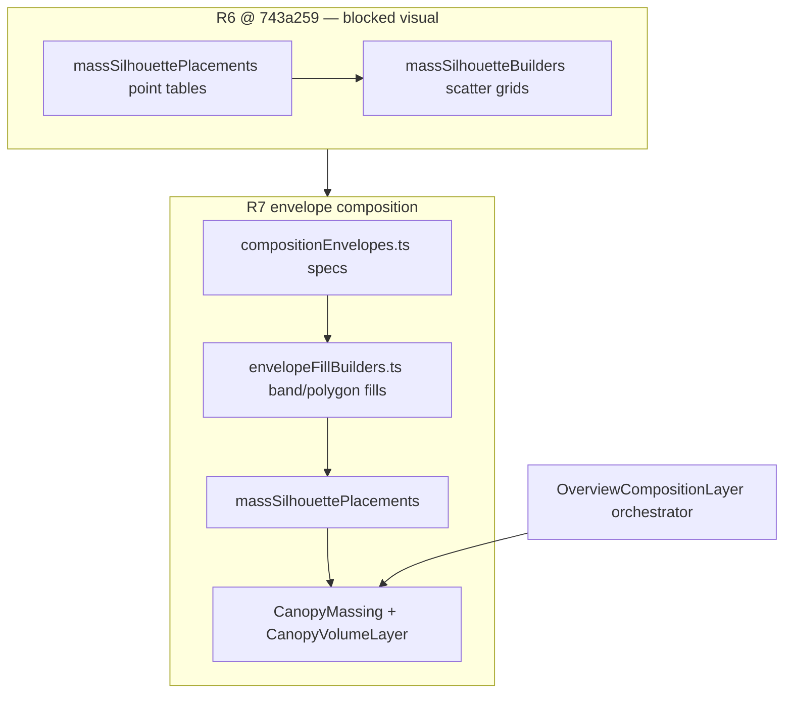

# WF02 Plan Revision 7 — Image-Space Composition Prototype Gate

**State:** WAITING_FOR_CHATGPT_PLAN_APPROVAL  
**Supersedes:** Plan revision 6 (`Docs/milestones/WF02/PLAN_R6.md`)  
**Investigation base SHA:** `743a2599409bfa0531807f2dc574aa25c475bc1b` (WF02-005 blocked @ R6)  
**Branch:** `cursor/wf02-scale-calibration-754a`  
**Scope:** PLAN ONLY — no production code, asset import/repack, or evidence capture until `[GOD-MODE:CHATGPT-PLAN-DECISION] Decision: APPROVED_TO_BUILD`

---

## 1. Work item

WF02 — North-Star Scale & Aesthetic Calibration (presentation-only; simulation/geography frozen).

---

## 2. Decision context

| Review | SHA | Gate | Lesson |
|---|---|---|---|
| WF02-004 (R5.1) | `fa64055` | BLOCKED | GPU budget spent; orchard/park tiers empty; atlas cannot fill void |
| WF02-005 (R6) | `743a259` | BLOCKED | **5th consecutive visual hard-gate failure** — MSS recovered DC/tris but **image-space composition unchanged** |
| ChatGPT FIX_REQUIRED | `743a259` | Plan R7 required | **Composition/art-direction design failure**, not rendering-budget failure |

**Engineering preserved @ `743a259` (must not regress):**

| Check | Result |
|---|---|
| Unit + integration | **169/169 PASS** |
| E2e | **7/7 PASS** |
| Asset/network errors | **0** |
| `facilityPoints.ts` / `simulation/**` | Frozen |
| Overview live GL | **117–120 DC / ~45–46k tris** |
| Street live GL | **72–75 DC / ~80k tris** |

**Grok WF02-005 verdict (authoritative):** R6 Overview remains **visually stagnant vs R5.1** — sparse/flat, facilities isolated in a broad field, outside north-star miniature-town family. Metrics and non-empty placement tables passed; **rendered hierarchy did not.**

---

## 3. Executive summary — R7 authorized path

R7 is **not** R6-plus-density, not another scatter pass, and not a tint/constants tweak.

### Build Path P-CPG (Composition Prototype Gate — mandatory)

| Phase | Name | Deliverable | Gate |
|---|---|---|---|
| **0** | **Composition prototype** | Frozen-camera composition map + perceptual hierarchy doc + annotated R6 failure overlays | ChatGPT approves **image-space design** before any broad code |
| **1** | Envelope mass refactor | Replace point-scatter heroes with **connected band/polygon fills** proven in Phase 0 | Pixel check per district |
| **2** | Value/height hierarchy | District-specific scale + material value roles (no atlas repack) | Overview 06:00 standalone readable |
| **3** | Integration + evidence | Full test gate, audits, published release compare chain | VST-R7 stop tests |

**Rejected without new plan revision:** count/coverage-percent targets as acceptance; RGB diagnostic metrics; global scale/camera change; phantom buildings; whole-pack import; spending recovered GPU budget because it exists; broad implementation before prototype approval.

**Preserved from R6:** MSS architecture (`OverviewCompositionLayer`, KCC/CVP batches, tier gating, warm atlas, performance recovery, determinism).

---

## 4. Root cause — why R6 failed visually (despite passing engineering)

R6 solved **representation cost** (Quaternius → Kenney/CVP) but not **dominant image-space composition**. Mandatory hero **counts** did not produce mandatory hero **silhouettes** at the frozen Overview/Angled cameras.

### 4.1 Dominant failure mode

The 14 authoritative facilities remain **visually isolated objects** in a **continuous meadow plane**. MSS additions read as **terrain-adjacent noise** rather than **district structure** that connects buildings, streets, and growth void into an inhabited miniature settlement.

### 4.2 R6 group diagnosis → image-space failure

| R6 group | Shipped | Why it did not read @ Overview `[10,93,54]→[30,2,4]` | R7 change class |
|---|---|---|---|
| **`ORCHARD_BLOCK_KCC`** | 40+ Kenney treeSmall grid @ farm-3 | Grid is **small, low, dispersed** in far upper field; individual 42-tris cones merge with meadow; **no connected canopy rectangle**; weak link to farmhouse | **Envelope fill:** dense connected block + taller perimeter + straw field band with value contrast; **farmhouse approach avenue** |
| **`ORCHARD_FIELD_BAND_CVP`** | 20 flat boxes | **Low height (scale ~0.35)**, straw color close to terrain farm band; reads as terrain strip not crop mass | **Raised band rows (scale 0.55–0.7)** + darker edge strip; **connected rows** not scattered points |
| **`PARK_RIVER_ARC_KCC`** | ~12–18 trees | Placed **outside park** due to road exclusions; reads as **scattered dots**, not curved **U-frame** mass framing river edge | **Connected west+north band** + interior promenade fill; park mass **adjacent to river**, not on road centerline |
| **`PARK_PROMENADE_CVP`** | ~8–12 mounds | Same hue as meadow (`canopyLight` ≈ terrain garden); **interior/exterior confusion** | **Distinct park-lawn value** (`groundPark` material) + **connected strip** along west edge |
| **`PERIPHERY_FOREST_FRAME_KCC`** | 40+ trees @ z≈−102 | At Overview distance trees are **tiny identical cones**; band too **thin** and **equidistant** — reads as fence posts not forest wall | **Darker value + scale ramp (1.1→1.35) + double-row north wall**; **depth stagger** for silhouette thickness |
| **`CIVIC_COLONNADE_KCC`** | 12 treeLarge ring r=9.5 | Ring **same scale as orchard trees**; plaza **empty warm plane** dominates; civic buildings (hall/school/clinic) **not framed as a cluster** | **Plaza warm pad + darker colonnade ring (1.25–1.4 scale) + corner anchor trees** linking to commercial spine |
| **`CIVIC_PLAZA_CVP`** | 8 garden mounds | **Interior corner dots**; merge with plaza ground; no **edge definition** | Replace with **4 connected plaza quadrant pads** (low, warm) — edge-aligned not center scatter |
| **`RESIDENTIAL_GARDEN_CVP`** | 32 interior mounds | **Inside hedges but below roofline**; houses still read as **detached** objects in void | **L-shaped connected garden bands** along block frontages + **street-edge tree pairs** linking houses 1–4 into one cluster read |
| **`RESIDENTIAL_STREET_TREES_KCC`** | Dual lines x=14,48 | Trees **too sparse (6 m spacing)** and **same scale as orchard**; no **street corridor** definition | **3 m spacing pairs** + **canopy band** along z=−42 loop connecting to future lots |
| **`FUTURE_LOT_GARDEN_CVP`** | 4 mounds × 8 lots | **Corner-only**; lots remain **empty fenced holes** | **Half-lot connected fill** per row (2 bands/lot) — reads as **prepared blocks** not pepper dots |
| **Commercial/work** | `CommercialStreetLife` only | Store/cafe/workshop **float** with no **frontage mass** connecting main cross to M02 corridor | **Commercial frontage band** (CVP + treeLarge accents) along z=0…+24 west edge — **no new buildings** |
| **Warm atlas** | Frozen | Helps **close/mid** shots; Overview void is **terrain + low mass** — atlas cannot compose settlement | **Keep frozen**; composition comes from **mass hierarchy**, not hue retune |
| **Terrain vertex bands** | Meadow/garden/farm | **Same value plane** as CVP; reduces contrast | **Keep carve authority**; R7 mass must **override** with height/value, not rely on vertex tint alone |

### 4.3 Meta-lesson (five consecutive blocks)

Passing **placement tables**, **coverage percentages**, or **DC/tris gates** does not satisfy WF02. The milestone requires ** perceptual district hierarchy** at frozen cameras — what a normal viewer sees **first, second, third** — not object inventory.

---

## 5. Composition Prototype Gate (Phase 0 — mandatory before broad code)

### 5.1 Prototype artifacts (plan approval deliverables — no runtime code)

| Artifact | Path | Purpose |
|---|---|---|
| **Overview composition map** | `Docs/milestones/WF02/composition_map_r7.svg` | Top-down envelopes on frozen Overview frustum |
| **Perceptual hierarchy** | `Docs/milestones/WF02/COMPOSITION_PROTOTYPE_R7.md` | First/second/third read per district @ Overview + Angled |
| **R6 failure overlay** | `Docs/milestones/WF02/r6_failure_overlay_r7.svg` | Annotates R6 `@743a259` screenshot with diagnosis labels |
| **Prototype stills (mock)** | Embedded in COMPOSITION_PROTOTYPE_R7.md | Greyscale/value mock of intended silhouettes (not engine renders) |

**Phase 0 STOP:** ChatGPT approves composition map + hierarchy doc. **No Phase 1 code** until approval.

### 5.2 Prototype method

1. Export **frozen Overview 06:00** frame from R6 evidence (`01_wf02_overview_dawn.png` @ `743a259`).
2. Draw **district envelopes** as closed polygons/bands in screen space (SVG over screenshot).
3. Label **foreground / midground / background** depth strips.
4. Mark **negative-space corridors** (founder-town growth void) explicitly — must remain ≥28% non-sky frame.
5. Mark **occlusion rules**: no mass through roads/water; ≥1.5 m from M02 entrances; store/workshop gap preserved.
6. For each envelope, specify **dominant silhouette shape** (connected mass name), **height band**, **value role**, **batch**.

---

## 6. Frozen Overview composition map (world-space envelopes)

Camera frozen: Overview `[10,93,54]→[30,2,4]`, 1440×900. All coordinates world X/Z (Y up). Envelopes are **presentation-only**; they do not alter `CANONICAL_TOWN` authority.

### 6.1 Depth framing (screen-space intent)

| Depth | World band (approx) | Intended read |
|---|---|---|
| **Foreground** | z ∈ [−25, 15], x ∈ [−20, 25] | Main cross, civic plaza, M02 store/workshop relationship |
| **Midground** | z ∈ [−65, −25] ∪ [15, 45] | Residential cluster + future lots; commercial/industrial north arm |
| **Background** | z > 45, x > 40 | Farm/orchard block, river/park edge, periphery forest |

### 6.2 District envelopes (connected mass — not scatter points)

```
Legend: [KCC]=Kenney instanced band  [CVP]=volume primitive fill  [—]=negative space corridor

                    N  periphery forest band (z ≈ −100..−95)
    ┌────────────────────────────────────────────────────────────┐
    │ [KCC double-row]                                           │
    │    ┌ civic envelope ────────┐   ┌ commercial/work band ──┐ │
 W   │    │ plaza pad [CVP warm]   │   │ frontage band z=0..28  │ │
    │    │ colonnade [KCC dark]   │   │ tree accents store/cafe  │ │
    │    │ hall/school/clinic     │   │ workshop/warehouse arm   │ │
    │    └───────────┬────────────┘   └───────────┬──────────────┘ │
    │                │ main cross (NEGATIVE)       │              │
    │    ┌─────────── residential cluster envelope ─────────────┐ │
    │    │ L-garden bands house block + street tree pairs        │ │
    │    │ future-lot row bands (z ≈ −48..−62)                   │ │
    │    └────────────────────────────────────────────────────────┘ │
    │                              river edge                     │
    │                    ┌ park U-frame [KCC+CVP] ──── river ──── │
    │                    │                                         │
    │              ┌ orchard BLOCK [KCC dense + CVP field] ────────┤
    │              │  farmhouse anchor                             │
    └──────────────┴───────────────────────────────────────────────┘
         [KCC west wall x ≈ −104]
```

### 6.3 Negative-space corridors (must remain visible @ 06:00)

| Corridor | Bounds | Purpose |
|---|---|---|
| Founder growth void | Central meadow wedge x∈[0,45], z∈[15,75] | ~20-founder town — not filled with mass |
| Main cross visibility | Roads `road-main-ew`, `road-main-ns` | Civic/commercial readability |
| M02 attachment sightline | store → workshop z gap | Door/path honesty |
| Farm approach | `road-farm` centerline clear | Orchard block south of road, not on it |

### 6.4 Occlusion / exclusion rules (unchanged authority)

All fills pass `isOverlayExcluded()` + R6 margins. Additional R7 rules:

| Rule | Margin | Protects |
|---|---|---|
| Road surface | ≥0.35 m (existing) | No z-fight |
| River water | ≥1.5 m | Park/orchard east edge |
| M02 entrances | ≥1.5 m | house-1, store, workshop |
| Square fountain | radius 3.8 m | Civic plaza center |
| Store/workshop AABB | gap ≥0.10 m | M02 audit |

---

## 7. Perceptual hierarchy — what the viewer must see (not counts)

### 7.1 Overview 06:00 — district read order

| District | 1st read | 2nd read | 3rd read | Dominant silhouette | Height band | Value role |
|---|---|---|---|---|---|---|
| **Civic** | Warm **plaza pad** + hall/school mass | **Dark colonnade ring** | Main cross opening | Connected ring + pad | CVP 0.08 m / trees 1.25–1.4 | `civic_cream` pad + `canopyDeep` ring |
| **Commercial/work** | Store/cafe **frontage band** along north arm | Workshop/warehouse silhouettes | Tree accents at corners | z=0…+28 **west edge band** | CVP 0.12 m + treeLarge 1.15 | `warm_commercial` + `canopyDeep` |
| **Residential** | **Hedge-enclosed block** shape (4 houses) | Street-tree **pairs** linking block | Future-lot row beyond loop | L-shaped garden bands | CVP 0.10 m + treeSmall 1.0 | `canopyLight` gardens |
| **Future lots** | **Two-row prepared blocks** (8 lots) | Fence perimeter | Loop road | Half-lot band fills | CVP 0.08 m | `groundGarden` |
| **Farm/orchard** | **Solid dark-green rectangle** @ farm-3 | Straw **field band** south | Farmhouse + approach | 8×6 dense block + perimeter | KCC 1.05–1.15 / field 0.6 | `canopyDeep` + `groundFarm` |
| **River/park** | **U-frame** west/north of park | River blue edge | Bridge read | Connected band + promenade | KCC 1.0 / CVP 0.10 m | `groundPark` + `canopyDeep` |
| **Periphery** | **Dark north wall** | West wall depth | NE accents | Double-row stagger | treeSmall 1.15–1.35 | `canopyDeep` |

### 7.2 Angled `[68,53,37]→[28,3,2]` — adjusted emphasis

| District | 1st read | 2nd read | Notes |
|---|---|---|---|
| Civic + commercial | Frontage band + plaza ring | Main cross depth | Angled must show **inhabited spine** |
| Residential | Cluster block + loop | Future lots recede | Street trees define **corridor** |
| Farm/orchard | Orchard block thickness | Farmhouse | Block must **overlap skyline** not dot field |
| River/park | U-frame + water | Periphery | Park mass **frames** river not road |

---

## 8. R7 technical approach — evolve MSS, do not fork

### 8.1 New modules (presentation-only)

| File | Responsibility |
|---|---|
| `src/rendering/environment/compositionEnvelopes.ts` | Declarative **connected band/polygon specs** per district; exports envelope IDs + world polygons |
| `src/rendering/environment/envelopeFillBuilders.ts` | Pure functions: `buildBandFill()`, `buildPolygonStrip()`, `buildLShapeFill()`, `buildUFrame()` → KCC/CVP placements |
| `Docs/milestones/WF02/composition_map_r7.svg` | Canonical envelope diagram (Phase 0) |
| `scripts/wf02-r7-composition-audit.mjs` | Validates envelope centroids project inside intended screen regions @ frozen camera |

### 8.2 Modified modules (only where prototype proves value)

| File | R7 change |
|---|---|
| `massSilhouetteBuilders.ts` | Refactor heroes to call **envelope fill builders**; deprecate point-grid heroes |
| `massSilhouettePlacements.ts` | Tables driven by `compositionEnvelopes.ts` specs |
| `CanopyMassing.tsx` | Optional per-envelope scale bias (presentation matrix only) |
| `CanopyVolumeLayer.tsx` | **≤3 CVP materials** for value roles (`canopyDeep`, `canopyLight`, `groundFarm`) — still ≤3 DC |
| `DistrictPalette.ts` | Export CVP material refs by role (no atlas change) |
| `OverviewCompositionLayer.tsx` | Add **`CommercialFrontageBand`** envelope component if not covered by envelope fill |
| `compositionVisibility.ts` | Unchanged tier lists unless prototype requires Angled-only periphery trim |

### 8.3 Explicitly unchanged

| Module | Reason |
|---|---|
| `facilityPoints.ts`, `simulation/**`, `townLayout.ts` geometry | Authority frozen |
| `cameraPresets.ts` | Frozen Overview/Angled |
| Warm atlas GLBs | Frozen @ R5.1 |
| `CommercialStreetLife`, `FutureLotPresentation`, `ResidentialHedges` | Keep; R7 **connects** them via envelopes |

### 8.4 Asset policy (asset-first, bounded)

| Allowed | Condition |
|---|---|
| Kenney `treeSmall`, `treeLarge`, `fenceLow` | Already registered; instanced bands only |
| CVP primitives | Existing `gardenMound`, `fieldBand` geometries — scale/value change only |
| Quaternius | Street/M02/attachment presets only (R6 tier rule preserved) |
| Kenney props (`detail-awning`, etc.) | Existing `CommercialStreetLife` — no expansion without provenance table |

| Forbidden |
|---|
| New building family, phantom facilities, generic box filler, whole-pack import, `building-type-f.glb` |

**Optional bounded proposal (requires explicit row in plan if used):** Kenney `path-short` instanced as **plaza/promenade edge** (12 tris, 1 DC) — presentation-only, not new roads.

---

## 9. Performance budget — keep R6 win, do not spend because it exists

**Baseline @ `743a259` (preserve):**

| Preset | DC | Tris |
|---|---:|---:|
| Overview 06:00 | 117 | 45,536 |
| Overview 12:00 | 120 | 45,872 |
| Angled | 110 | 47,132 |
| Street | 75 | 80,730 |

**R7 gates (strict):**

| Gate | Target | Hard cap |
|---|---:|---:|
| Overview DC | **≤125** | **≤135** (≥5 reserve vs 140) |
| Overview visible tris | **≤100,000** | **≤118,000** |
| Street DC | **≤85** | **≤100** |
| CVP materials | ≤3 | ≤3 DC |
| M03 reserve | Incidental only | Document per M03_HEADROOM.md |

**Budget discipline:** Envelope fills replace scatter — net instance count may rise but **DC must not exceed prototype budget**. Measure after **each district envelope** lands; prune in order: future-lot fill −50%, civic pad −25%, NE periphery accents — **never** orchard block, park U-frame, commercial frontage, M02 corridor.

---

## 10. Implementation phases (post-approval only)

| Phase | Deliverable | Pixel gate |
|---|---|---|
| **0** | Composition map SVG + COMPOSITION_PROTOTYPE_R7.md + R6 overlay | ChatGPT **APPROVED_TO_BUILD** on design |
| **1a** | Orchard **envelope prototype** only — one district in engine | Overview: farm-orchard reads **solid block** vs R6 |
| **1b** | Civic + commercial frontage envelopes | Overview: **plaza anchor + inhabited spine** |
| **1c** | Residential cluster + future-lot row envelopes | Overview: houses read as **one block** |
| **1d** | Park U-frame + periphery double-row | Overview: **river/park framed** + dark edge band |
| **2** | Full integration, tier audit, tests | All VST-R7 pass |
| **3** | Evidence release + BUILDER handoff | Published compare chain |

**Phase 1a–1d each require** capture of Overview 06:00 still @ frozen camera before next district. **Stop and revise plan** if VST-R7-01 fails at 1a.

---

## 11. Evidence plan (failure must be visible)

### 11.1 Compare chain (frozen camera, published before READY)

| Panel | Source |
|---|---|
| WF01 BEFORE | `review-evidence-wf01-builder-r5` |
| R5.1 blocked | `review-evidence-wf02-r51-fa64055` |
| R6 blocked | `review-evidence-wf02-r6-743a259` |
| R7 prototype/build | `review-evidence-wf02-r7-<sha>` |
| NORTH STAR | `Docs/art-direction/references/god-mode-town-north-star.png` |

**Primary acceptance image:** Overview **06:00** gameplay (not noon rescue).

### 11.2 Required shots @ implementation SHA

Overview dawn/noon (diagnostics), Angled, civic, residential/future lots, commercial/work, farm/orchard hero, river/park, Street citizen+door+road, store/workshop, night, attachments, composition-map diagnostic, manifest with exact SHA, **0** asset/network/404 errors.

### 11.3 Script updates

| Script | Change |
|---|---|
| `scripts/capture-wf02-evidence.mjs` | R7 tag; compare strip includes R6 blocked; reject stale overview filenames |
| `scripts/wf02-r7-composition-audit.mjs` | **NEW** — screen-space envelope centroid checks |
| `scripts/wf02-r41-audit.mjs` | Re-run pre-READY (14-facility + M02 gap) |

---

## 12. Do-not-touch list

| Path | Reason |
|---|---|
| `src/simulation/**` | WF02 presentation-only |
| `src/world/facilityPoints.ts` | Sim anchor authority |
| M02 entrances/routes | Regression gate |
| Road topology, river carve | Geography frozen |
| R2 `targetWidth`, citizen 2.32/1.8 m | Scale frozen |
| Overview/Angled camera constants | Evidence chain |
| Warm atlas repack | Frozen @ R5.1 |

---

## 13. Facility / door / road invariants (re-audit pre-READY)

Re-run `scripts/wf02-r41-audit.mjs`:

- 14-facility scale table unchanged
- Store/workshop gap **≥0.10 m**; entrances frozen
- Envelope fills ≥1.5 m from M02 entrance paths
- No mass on road/water surfaces

---

## 14. Tests

| Test | Coverage |
|---|---|
| `tests/unit/wf02/compositionEnvelopes.test.ts` | **NEW** — envelope specs non-empty; band fills respect exclusions |
| `tests/unit/wf02/envelopeFillBuilders.test.ts` | **NEW** — connected fills produce minimum placement density |
| `tests/unit/wf02/massSilhouettePlacements.test.ts` | Update — heroes driven by envelopes not point tables |
| `tests/unit/wf02/compositionVisibility.test.ts` | Regression — Overview zero Quaternius |
| `npm run test:all` | Must stay green (≥169 unit + 7 e2e) |

---

## 15. Data flow (R6 → R7)



---

## 16. Rollback

| Step | Action |
|---|---|
| 1 | `git revert` R7 envelope commits |
| 2 | Restore R6 `@743a259` massSilhouette tables |
| 3 | Re-run tests @ R6 parity |
| 4 | Atlas unchanged |

---

## 17. Objective visual stop tests (falsifiable)

| ID | Stop test | Fail = do not hand off |
|---|---|---|
| VST-R7-01 | Overview 06:00 @ normal size: **unmistakable** delta vs R6 **and** R5.1 | **STOP** |
| VST-R7-02 | **Civic anchor** — plaza pad + colonnade read before bare meadow | **STOP** |
| VST-R7-03 | **Residential cluster** — 4 houses read as one block, not 4 islands | **STOP** |
| VST-R7-04 | **Orchard block** — solid rectangle silhouette, not dot grid | **STOP** |
| VST-R7-05 | **River/park** — U-frame mass + water edge, not scattered trees | **STOP** |
| VST-R7-06 | **Commercial/work** — frontage band connects store/cafe/workshop arm | **STOP** |
| VST-R7-07 | CVP reads as **vegetation/garden/field**, not placeholder geometry | **STOP** |
| VST-R7-08 | Overview DC **≤125** target / **≤135** hard; tris **≤100k** target | **STOP** (engineering) |
| VST-R7-09 | Angled confirms depth hierarchy (foreground spine + background orchard) | **STOP** |

**Builder self-check:** If Phase 1a orchard prototype alone fails VST-R7-04 on local capture, **do not proceed** to full-district rollout — revise envelope spec first.

---

## 18. Plan gate

**State:** `WAITING_FOR_CHATGPT_PLAN_APPROVAL`

**STOP.** No production code, asset changes, evidence capture, merge, or M03 work until:

`[GOD-MODE:CHATGPT-PLAN-DECISION] Work item: WF02 Plan revision: 7 Decision: APPROVED_TO_BUILD`

---

**Document:** `Docs/milestones/WF02/PLAN_R7.md`  
**Posted by:** Composer (builder)  
**Investigation base:** `743a2599409bfa0531807f2dc574aa25c475bc1b`
