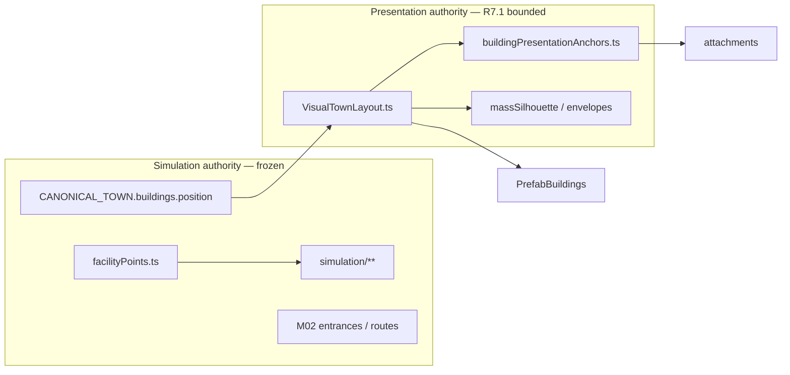

# WF02 Plan Revision 7.1 — North-Star Composition Reset

**State:** WAITING_FOR_CHATGPT_PLAN_APPROVAL  
**Supersedes:** Plan revision 7 (`Docs/milestones/WF02/PLAN_R7.md`)  
**Investigation base SHA:** `743a2599409bfa0531807f2dc574aa25c475bc1b` (WF02-005 blocked @ R6)  
**Plan R7 head SHA:** `a5d3a1cdaca05bb8eabcedb1e59f228177da40ca` (PLAN_CHANGES_REQUIRED)  
**Branch:** `cursor/wf02-scale-calibration-754a`  
**Scope:** PLAN ONLY — no production code, asset import/repack, evidence capture, merge, or M03 until `[GOD-MODE:CHATGPT-PLAN-DECISION] Decision: APPROVED_TO_BUILD`

---

## 1. Work item

WF02 — North-Star Scale & Aesthetic Calibration (presentation-only; **simulation truth frozen underneath**).

---

## 2. Decision context

| Review | SHA | Gate | Lesson |
|---|---|---|---|
| WF02-005 (R6) | `743a259` | BLOCKED | **5th consecutive visual hard-gate failure** — MSS recovered DC/tris; image-space unchanged |
| ChatGPT FIX_REQUIRED | `743a259` | Plan R7 required | Composition/art-direction failure, not GPU budget |
| Plan R7 posted | `a5d3a1c` | CPG direction OK | Correct process; **solution still froze constraints likely causing five failures** |
| ChatGPT PLAN_CHANGES_REQUIRED | `a5d3a1c` | Plan R7.1 required | **North-Star Composition Reset** — controlled presentation freedom |

**Engineering preserved @ `743a259` (must not regress):**

| Check | Result |
|---|---|
| Unit + integration | **169/169 PASS** |
| E2e | **7/7 PASS** |
| Asset/network errors | **0** |
| `facilityPoints.ts` / `simulation/**` | Frozen |
| Overview live GL | **117–120 DC / ~45–46k tris** |
| Street live GL | **72–75 DC / ~80k tris** |

**R7.1 thesis:** R7 correctly diagnosed R6 (point/count mass ≠ perceptual hierarchy) and introduced the Composition Prototype Gate. R7.1 adds the **missing presentation freedoms** — visual layout mapping, compact hero core, designed voids, reopened asset vocabulary, optional vertical layering, and **pixel-composited prototype acceptance** — without touching simulation authority.

---

## 3. Executive summary — North-Star Composition Reset

R7.1 is **not** another connected-fill pass under the same visual-placement and silhouette constraints. Five failures prove that approach is not an acceptable next experiment.

### Build Path P-CPG+ (Composition Prototype Gate with presentation reset)

| Phase | Name | Deliverable | Gate |
|---|---|---|---|
| **0a** | Kenney inventory audit | Registered vs on-disk vs north-star gap table | Identifies bounded asset candidates |
| **0b** | **Visual composition prototype** | Composited Overview + Angled pixels over R6 frame; hero-core map; void design doc | ChatGPT **prototype decision** (§7) |
| **1** | `VisualTownLayout` + envelope fills | Presentation mapping module; connected masses proven in 0b | Per-district pixel gate |
| **2** | Optional vertical layer + curated assets | Presentation embankments / props if 0b requires | Rollback boundary documented |
| **3** | Integration + evidence | Full test gate, audits, published compare chain | VST-R71 stop tests |

**Rejected without new plan revision:** another scatter/count pass; quota-protected void percentages; constraining solution to existing 14 silhouettes only; greyscale/SVG-only prototype acceptance; spending recovered GPU budget because it exists; broad implementation before Phase 0b prototype approval.

**Preserved from R6:** MSS architecture, tier gating, warm atlas, performance recovery, determinism, single `OverviewCompositionLayer` orchestrator.

---

## 4. Root cause — why R6 (and R7-as-written) fail visually

### 4.1 Dominant failure mode (unchanged from R7)

The 14 authoritative facilities remain **visually isolated objects** in a **continuous 240 m meadow plane**. MSS additions read as terrain-adjacent noise, not district structure.

### 4.2 Constraint stack responsible for five blocks

| Frozen constraint | Visual consequence | R7.1 response |
|---|---|---|
| **1:1 sim center → render center** (except tiny offsets) | Facilities spread across full 240 m board at equal weight | **`VisualTownLayout`** — bounded visual centers/rotations; attachments derive from visual transform |
| **Equal attention across full board** | Overview reads sparse green field with distant dots | **Compact hero core ~100–140 m**; outer ring = farm/forest/river/expansion |
| **Void = “don’t fill” quota** | Meadow reads as unused board, not intentional landscape | **Designed void catalog** — each major void has authored treatment + purpose |
| **14 facility silhouettes only** | Civic/commercial/farm lack north-star architectural hierarchy | **Asset vocabulary reopened** — audit + curated presentation-only additions |
| **Flat simulation terrain plane** | No vertical rhythm; CVP mounds merge with ground | **Presentation vertical layering** evaluated in prototype |
| **Count/table acceptance** | Heroes pass metrics but not image hierarchy | **Pixel-composited prototype** + explicit Phase 0 STOP fork |

### 4.3 R6 group diagnosis (retained from R7 §4.2)

R6 hero groups failed because they were **small, low, dispersed, merged with terrain, or outside useful image-space** — not because the envelope concept was wrong. R7.1 retains connected-mass direction but adds **visual repositioning within the hero core**, **height/value tiers**, and **optional presentation props** where the prototype proves need.

---

## 5. Simulation vs presentation layout (mandatory separation)

### 5.1 Authority model



| Layer | Owns | Must not change |
|---|---|---|
| **Simulation** | `facilityPoints.ts`, logical centers, M02 entrances/routes, pathfinding, worker authority | — |
| **Geography** | `CANONICAL_TOWN` roads, river carve, terrain height function, `groundExtent` | Road topology, river authority |
| **Presentation** | Visual center, rotation, max offset, attachment placement, mass envelopes, optional presentation terrain meshes | Simulation IDs, logical facility truth |

**Rule:** `PrefabBuildings.tsx` and attachment resolvers read **`resolveVisualTransform(facilityId)`** instead of `CANONICAL_TOWN.position` + ad-hoc `resolvePresentationTransform` switches. Simulation code continues reading `facilityPoints.ts` / `CANONICAL_TOWN` only.

### 5.2 Module contract

| File | Responsibility |
|---|---|
| `src/rendering/environment/VisualTownLayout.ts` | **NEW** — declarative map: `facilityId → { authCenter, visualCenter, rotationY, rotationDelta, maxOffsetM }` |
| `src/rendering/assets/buildings/buildingPresentationAnchors.ts` | Attachments derive from **visual** transform + footprint (not auth center alone) |
| `tests/unit/wf02/visualTownLayout.test.ts` | **NEW** — all 14 facilities: offset ≤ maxOffsetM; M02 logical entrances unchanged in sim |

### 5.3 Fourteen-facility presentation mapping (Phase 0 draft — prototype tuning allowed)

**Global rules:**

- `targetWidth` values **frozen** from R4.1 (R3 widths unchanged).
- `maxOffsetM` = maximum Euclidean XZ distance from auth center to visual center (hard cap per facility).
- M02 trio: visual offset must preserve **door/path readability** and store↔workshop AABB gap ≥ **0.10 m** after transform.
- Attachments (awning, paths, parasol, driveways) re-anchor to **visual** facade, not auth center.

**Auth centers** from `CANONICAL_TOWN` @ investigation SHA. **Proposed visual centers** compress the inhabited read into a ~120 m hero core (§6). Values below are **Phase 0 prototype targets** — Phase 0b composited pixels validate before code.

| Facility | Auth (x,z) | Proposed visual (x,z) | Δ (m) | rotY (base) | rotΔ | maxOffsetM | Rationale |
|---|---|---|---:|---|---:|---:|---|
| community-hall | (−18,−18) | (−16,−14) | 4.5 | π | 0 | **6** | Pull civic cluster toward main cross; anchor plaza |
| clinic | (−42,−14) | (−38,−12) | 4.5 | π | −0.03 | **6** | Tighten civic wedge; keep road clearance |
| school | (−24,−48) | (−22,−44) | 4.5 | π | 0 | **6** | Move toward civic/residential seam |
| house-1 | (11,−10) | (14,−8) | 3.6 | −π/2 | 0 | **4** | M02 — minimal shift toward block center |
| house-2 | (30,−12) | (28,−10) | 2.8 | −π/2 | +0.06 | **4** | Close gap in residential cluster |
| house-3 | (11,−30) | (14,−28) | 3.6 | 0 | 0 | **4** | Block cohesion |
| house-4 | (30,−30) | (28,−28) | 2.8 | −π/2 | −0.04 | **4** | Block cohesion |
| apartment | (52,−22) | (46,−20) | 6.5 | −π/2 | +0.04 | **8** | Pull into residential arm (largest allowed offset) |
| store | (−11,11) | (−10,8) | 3.2 | 0 | 0 | **4** | M02 — tighten commercial spine toward cross |
| cafe | (−30,12) | (−28,10) | 2.8 | π | +0.05 | **5** | Frontage band alignment |
| workshop | (−11,23) | (−10,19) | 4.1 | 0 | −0.03 | **5** | M02 — preserve store gap; shorten north arm visually |
| warehouse | (−38,48) | (−36,42) | 6.3 | π | 0 | **8** | Pull industrial read toward hero core edge |
| utility | (−52,30) | (−48,28) | 4.5 | π | −0.05 | **6** | Align with industrial band |
| farmhouse | (28,82) | (32,68) | 14.6 | −π/2 | 0 | **16** | **Farm district** — largest offset; pulls farm anchor into mid-background read while auth sim center unchanged |

**M02 audit targets post-visual-transform (re-run @ implementation):**

| Check | Gate |
|---|---|
| Sim entrances (house-1, store, workshop) | **Unchanged** in `facilityPoints.ts` |
| Presentation door facades | ≥ **1.5 m** walkable read from nearest mass band |
| Store↔workshop presentation AABB gap | ≥ **0.10 m** |
| Auth route polyline | Untouched; visual paths are presentation-only overlays |

**Rollback:** delete `VisualTownLayout.ts`; restore `resolvePresentationTransform` per-building switches @ R6.

---

## 6. Compact hero core (~100–140 m inhabited visual core)

### 6.1 Problem

The 240 m `groundExtent` board reads as **mostly empty green** at frozen Overview. R7 spread equal envelope attention across the full board, reproducing stagnation.

### 6.2 Hero core envelope (world-space, presentation-only)

| Zone | Approx bounds (x, z) | Screen role @ Overview | Content |
|---|---|---|---|
| **Hero core** | x ∈ [−55, 55], z ∈ [−55, 35] | **~70% of perceived settlement mass** | Civic + commercial/work + residential + future-lot preparation |
| **Mid landscape** | x ∈ [−70, 70], z ∈ [35, 65] | Transition | Park/river edge, meadow seam, farm approach |
| **Outer authored** | \|x\| > 55 or z > 65 or z < −70 | Background/periphery | Orchard block, periphery forest, river corridor, expansion meadow |

**Design intent:** A normal viewer at Overview 06:00 sees a **dense miniature town core** first, with farm/forest/river reading as **intentional landscape framing** — not “undeveloped green board.”

### 6.3 ASCII hero-core map (frozen Overview camera)

```
                    [outer: periphery forest — dark band]
    ┌──────────────────────────────────────────────────────────┐
    │  mid: park U-frame + river edge (z ≈ 35–55)              │
    │  ┌──────────────── HERO CORE (~120 m) ─────────────────┐ │
    │  │ civic (−16,−14) ── plaza ── commercial spine       │ │
    │  │     │ main cross (DESIGNED VOID — meadow treatment)  │ │
    │  │ residential block (14,−8)…(28,−28) + future lots    │ │
    │  └──────────────────────────────────────────────────────┘ │
    │  mid: farm approach + orchard block (farmhouse visual @32,68) │
    │  outer: expansion meadow + eastern river (DESIGNED — not “empty”) │
    └──────────────────────────────────────────────────────────┘
```

---

## 7. Designed negative space (not quota-protected)

### 7.1 Removed acceptance target

~~≥28% non-sky frame void quota~~ — **removed**. Pixel composition at frozen Overview decides.

### 7.2 Major void catalog (each must be intentional @ 06:00)

| Void | Bounds (approx) | Treatment | Viewer read |
|---|---|---|---|
| **Founder growth meadow** | x ∈ [5, 42], z ∈ [18, 55] | Warm grass value + low meadow CVP texture + **sparse edge trees only** (no fill) | “Room to grow” — not abandoned board |
| **Main cross opening** | \|x\| < 3, \|z\| < 3 | Road + sidewalk authority; no mass | Civic/commercial spine readable |
| **Civic plaza center** | Square r ≈ 8 m | Warm plaza pad + optional fountain prop (if audit approves) | Civic anchor |
| **Residential loop interior** | Loop polygon center | Garden bands + hedges — **prepared**, not empty lots | Suburb block |
| **Future lots (8)** | plot centers | Half-lot band fills + fences — **no phantom buildings** | Prepared expansion |
| **Farm approach corridor** | `road-farm` centerline buffer | Clear approach + field band edges | Connects core to orchard |
| **Eastern river corridor** | x ≳ 74 | Water + bank vegetation | Landscape frame |
| **Northwest industrial apron** | warehouse/utility forecourts | Gravel CVP + frontage strip | Work district, not void |

Phase 0b prototype must **label every retained void** on the composited Overview with its treatment name.

---

## 8. Asset vocabulary — reopened (audit-first)

### 8.1 Phase 0a — mandatory Kenney inventory audit

| Artifact | Path |
|---|---|
| Audit script | `scripts/wf02-r71-kenney-inventory-audit.mjs` |
| Report | `Docs/milestones/WF02/KENNEY_INVENTORY_AUDIT_R71.md` |

**Method:**

1. Enumerate all files under `public/assets/glb/kenney/**` (on disk).
2. Cross-reference `EnvironmentAssetRegistry.ts`, `ASSET_REGISTER.md`, `modelLayoutManifest.json`.
3. For each unregistered GLB: record pack, original Kenney name, tri/DC estimate (from manifest), license (CC0), proposed bounded use case.
4. Map gaps vs north-star reference (`Docs/art-direction/references/god-mode-town-north-star.png`) by district.

### 8.2 Currently registered building/prop vocabulary (baseline)

| Category | Registered paths | Used for |
|---|---|---|
| Suburban homes | `home-cottage`, `home-type-a/c/d`, `apartment-block`, `farmhouse` | 14 facilities (partial) |
| Commercial | `store-general`, `cafe-bistro`, `clinic`, `school`, `community-hall`, `detail-awning`, `detail-parasol-a` | Facilities + store/cafe dressing |
| Industrial | `workshop-industrial`, `warehouse`, `utility-station` | Work facilities |
| Nature/props | `tree-small`, `tree-large`, `fence-low`, `path-short/long`, `driveway-short` | MSS + hedges |
| Roads | 7 road GLBs | Topology (frozen) |

### 8.3 Candidate additions (Phase 0a must confirm on-disk + cost before approval)

**No import until ChatGPT approves exact rows.** Names below are **audit targets** from Kenney City Kit packs (CC0) — not speculative imports.

| Candidate (Kenney original) | Pack | Proposed use | Est. cost | Condition |
|---|---|---|---:|---|
| `detail-bench.glb` | Suburban | Civic plaza / park promenade seating silhouette | ~24 tris, shared mat | If on disk or single-file import |
| `detail-fountain.glb` | Suburban | Square center civic anchor | ~80 tris | If on disk; plaza exclusion radius preserved |
| `lamp-post.glb` / `detail-lamp.glb` | Suburban or Roads | Commercial frontage rhythm | ~36 tris, instanced | ≤12 instances Overview |
| `bush-large.glb` / shrub variants | Suburban | Residential garden bands | low tris | Prefer if already in suburban folder |
| `path-round.glb` | Suburban | Plaza/park edge definition | ~12 tris | Presentation-only; not new roads |

**Forbidden:** whole-pack import; phantom facilities; generic box buildings; `building-type-f.glb` (explicitly rejected in R4.1); any asset without provenance row in audit report.

**Principle:** R7.1 may add **presentation-only silhouettes/props** that improve cottage/civic/commercial/farm/park identity. It does **not** permanently constrain the solution to the existing 14 facility GLBs alone.

---

## 9. Presentation vertical layering (evaluate in prototype)

### 9.1 Problem

Simulation terrain is a **near-flat board** (`terrainHeightAt` gentle blend). CVP mounds at y ≈ 0.08–0.35 m merge with meadow vertex color → flat read persists.

### 9.2 Mechanism (presentation-only, if prototype selects)

| Layer | Module | Mechanism | Sim impact |
|---|---|---|---|
| **Embankment tier** | `PresentationTerrainLayer.tsx` | Low-poly skirt meshes following district envelopes; y = 0.15–0.8 m; **does not modify** `terrainHeightAt` | None |
| **Retaining edge** | `envelopeFillBuilders.ts` | CVP vertical face at envelope boundary (≤1 DC shared material) | None |
| **Raised planting bed** | CVP + embankment combo | Residential/civic beds raised 0.4–0.6 m above meadow | None |

**Citizen/door/road:** Presentation terrain must not intersect door thresholds or road surfaces (audit ≥0.35 m road margin). Street preset may disable embankment skirt.

### 9.3 Rollback boundary

| If selected | Rollback |
|---|---|
| `PresentationTerrainLayer` | Remove component from `OverviewCompositionLayer`; delete module |
| CVP retaining edges | Revert `envelopeFillBuilders` height constants to R6 |
| Sim terrain | **Never modified** |

Phase 0b composited prototype must show **with vs without** vertical layering side-by-side on Overview + Angled.

---

## 10. Composition Prototype Gate — Phase 0 deliverables

### 10.1 Required artifacts (no runtime code in Phase 0)

| Artifact | Path | Purpose |
|---|---|---|
| Kenney inventory audit | `KENNEY_INVENTORY_AUDIT_R71.md` | Asset vocabulary decision |
| Hero-core map | `Docs/milestones/WF02/composition_map_r71.svg` | Top-down hero core + outer zones |
| Perceptual hierarchy | `Docs/milestones/WF02/COMPOSITION_PROTOTYPE_R71.md` | 1st/2nd/3rd read per district @ Overview + Angled |
| R6 failure overlay | `Docs/milestones/WF02/r6_failure_overlay_r71.svg` | Diagnosis labels on R6 `@743a259` frame |
| **Composited Overview prototype** | `Docs/milestones/WF02/prototype_overview_r71.png` | **Mandatory** — R6 dawn frame + proposed masses/building visual transforms/value blocks |
| **Composited Angled prototype** | `Docs/milestones/WF02/prototype_angled_r71.png` | **Mandatory** — same method @ Angled camera |
| North-star reference panel | Embedded in prototype doc | Same scale strip for comparison |

**Greyscale/value mock alone is insufficient.** SVG geometry alone is insufficient. Phase 0 acceptance requires **actual composited pixels**.

### 10.2 Compositing method

1. Base: R6 evidence `01_wf02_overview_dawn.png` + `02_angled.png` @ `743a259`.
2. Overlay: district envelope fills, visual building footprints (from §5.3), height/value blocks, optional prop silhouettes from §8.3 audit.
3. Side panel: north-star reference @ same strip height.
4. Annotate: hero core boundary, void treatments (§7.2), 1st-read labels.

### 10.3 Perceptual hierarchy (Overview 06:00 — what viewer sees first)

| District | 1st read | 2nd read | 3rd read |
|---|---|---|---|
| **Hero core civic** | Warm plaza + hall/school mass | Dark colonnade ring | Cross opening |
| **Hero core commercial** | Store/cafe frontage band | Workshop/warehouse | Tree/prop accents |
| **Hero core residential** | Hedge block + visual-clustered houses | Street-tree corridor | Future-lot prepared rows |
| **Mid park/river** | U-frame + water edge | Promenade | Bridge |
| **Outer farm** | Orchard solid block | Field band | Farmhouse (visual @ 32,68) |
| **Outer periphery** | Dark forest wall | West depth | NE accents |

Angled: emphasize **inhabited spine depth** (foreground civic/commercial → mid residential → background orchard).

---

## 11. Phase 0 STOP — prototype decision fork (mandatory)

After Phase 0 artifacts are posted, Composer **STOPS**. ChatGPT returns one of:

| Decision | Meaning | Next step |
|---|---|---|
| **`APPROVED_TO_BUILD`** | Composited prototype materially approaches north-star family | Phase 1 implementation on same branch |
| **`PLAN_CHANGES_REQUIRED`** | Prototype still insufficient; revise plan | New plan revision; no code |
| **`CONSTRAINT_RELAXATION_REQUIRED`** | Prototype cannot approach north-star without relaxing a named constraint | Plan must explicitly recommend **which** constraint (e.g., `maxOffsetM`, hero-core size, optional asset class, vertical layer, Angled trim) — **do not proceed to Phase 1** |

**Builder obligation:** If composited prototype **cannot** materially approach north-star while respecting sim authority, state so explicitly in `COMPOSITION_PROTOTYPE_R71.md` and recommend the minimum constraint relaxation — do not silently proceed to envelope-fill implementation.

---

## 12. Technical approach (post-approval only)

### 12.1 New modules

| File | Responsibility |
|---|---|
| `VisualTownLayout.ts` | Presentation mapping §5 |
| `compositionEnvelopes.ts` | Connected band/polygon specs within hero core |
| `envelopeFillBuilders.ts` | Band/polygon/U-frame/L-shape → KCC/CVP placements |
| `PresentationTerrainLayer.tsx` | Optional embankment tiers §9 |
| `scripts/wf02-r71-composition-audit.mjs` | Screen-space: hero-core centroid, void labels, visual-offset bounds |
| `scripts/wf02-r71-kenney-inventory-audit.mjs` | Phase 0a asset audit |

### 12.2 Modified modules

| File | Change |
|---|---|
| `PrefabBuildings.tsx` | Read `resolveVisualTransform()` |
| `buildingPresentationAnchors.ts` | Attachments from visual transform |
| `massSilhouetteBuilders.ts` / `massSilhouettePlacements.ts` | Envelope fills + hero core scope |
| `CanopyMassing.tsx` / `CanopyVolumeLayer.tsx` | Envelope scale/value bias |
| `OverviewCompositionLayer.tsx` | Orchestrate new layers |

### 12.3 Explicitly unchanged

| Module | Reason |
|---|---|
| `facilityPoints.ts`, `simulation/**` | Sim authority |
| `CANONICAL_TOWN` roads, river, paths | Geography authority |
| M02 logical entrances/routes | Regression gate |
| `cameraPresets.ts` | Frozen Overview `[10,93,54]→[30,2,4]` / Angled |
| R2 `targetWidth` table | Scale frozen |
| Warm atlas GLBs | Frozen @ R5.1 |

---

## 13. Performance ledger (expanded option space)

**Baseline @ `743a259` (preserve — do not spend because it exists):**

| Preset | DC | Tris |
|---|---:|---:|
| Overview 06:00 | 117 | 45,536 |
| Overview 12:00 | 120 | 45,872 |
| Angled | 110 | 47,132 |
| Street | 75 | 80,730 |

### 13.1 Prototype-level option estimates (measure after each lands)

| Option | Est. Δ DC | Est. Δ tris | Notes |
|---|---:|---:|---|
| A — `VisualTownLayout` only | 0 | 0 | Reposition existing meshes |
| B — Hero-core envelope fills (R7 direction) | +6…+12 | +18k…+35k | Connected KCC/CVP bands |
| C — Presentation vertical layer | +1…+2 | +4k…+10k | Shared materials ≤2 DC |
| D — Curated props (≤12 plaza + ≤12 frontage) | +1…+2 | +2k…+6k | Instanced Kenney details |
| E — Optional audit-approved silhouettes | +2…+4 | +8k…+20k | Only if Phase 0a approves exact assets |

### 13.2 R7.1 gates

| Gate | Target | Hard cap |
|---|---:|---:|
| Overview DC | **≤125** | **≤135** (≥5 reserve vs 140) |
| Overview visible tris | **≤100,000** | **≤118,000** |
| Street DC | **≤85** | **≤100** |
| CVP + presentation terrain materials | ≤4 DC combined | ≤5 DC |
| **M03 20-citizen headroom** | ≥5 DC + ≥8k tris reserve | Per `M03_HEADROOM.md` — LOD/culling required; not raw WF02 slack |

**Budget discipline:** Select options A→E only as prototype proves need. Prune order if over target: NE periphery accents → future-lot fill −50% → optional props −50% — **never** hero core civic/residential/commercial/orchard block.

---

## 14. Implementation phases (post-approval only)

| Phase | Deliverable | Pixel gate |
|---|---|---|
| **0a** | Kenney inventory audit | Gap table complete |
| **0b** | Composited Overview + Angled prototypes + docs | §11 prototype decision |
| **1a** | `VisualTownLayout` + orchard envelope in engine | VST-R71-04 |
| **1b** | Civic + commercial hero-core envelopes | VST-R71-02, -06 |
| **1c** | Residential cluster + future-lot envelopes | VST-R71-03 |
| **1d** | Park U-frame + periphery + optional vertical layer | VST-R71-05 |
| **2** | Curated assets (if approved) + full integration | All VST-R71 |
| **3** | Evidence release + BUILDER handoff | Published compare chain |

Each Phase 1 sub-step requires Overview 06:00 capture before continuing. Fail VST-R71-01 at 1a → **STOP**, revise prototype (return to §11).

---

## 15. Evidence plan

### 15.1 Compare chain (frozen camera)

| Panel | Source |
|---|---|
| WF01 BEFORE | `review-evidence-wf01-builder-r5` |
| R5.1 blocked | `review-evidence-wf02-r51-fa64055` |
| R6 blocked | `review-evidence-wf02-r6-743a259` |
| R7.1 prototype | `Docs/milestones/WF02/prototype_overview_r71.png` (Phase 0b) |
| R7.1 build | `review-evidence-wf02-r71-<sha>` |
| NORTH STAR | `Docs/art-direction/references/god-mode-town-north-star.png` |

**Primary acceptance:** Overview **06:00** gameplay @ implementation SHA.

### 15.2 Required shots @ implementation SHA

Overview dawn/noon, Angled, civic, residential/future lots, commercial/work, farm/orchard, river/park, Street citizen+door+road, store/workshop, night, attachments, prototype/compare diagnostic, manifest exact SHA, **0** asset/network/404 errors.

### 15.3 Scripts

| Script | Role |
|---|---|
| `scripts/capture-wf02-evidence.mjs` | R7.1 tag; R6 in compare strip; reject stale filenames |
| `scripts/wf02-r71-composition-audit.mjs` | Hero core + visual offset + void checks |
| `scripts/wf02-r71-kenney-inventory-audit.mjs` | Phase 0a |
| `scripts/wf02-r41-audit.mjs` | 14-facility + M02 gap pre-READY |

---

## 16. Do-not-touch list

| Path | Reason |
|---|---|
| `src/simulation/**` | WF02 presentation-only |
| `src/world/facilityPoints.ts` | Sim anchor authority |
| M02 **logical** entrances/routes | Worker/pathfinding truth |
| Road topology, river carve, `terrainHeightAt` authority | Geography frozen |
| R2 `targetWidth`, citizen 2.32/1.8 m | Scale frozen |
| Overview/Angled camera constants | Evidence chain |
| Warm atlas repack | Frozen @ R5.1 |
| M03 gameplay / 20-citizen spawn | Out of scope |
| Runtime LLM/API | Constitution rule |

---

## 17. Facility / door / road invariants (re-audit pre-READY)

Re-run `scripts/wf02-r41-audit.mjs` against **visual** transforms:

- 14-facility `targetWidth` unchanged
- Store↔workshop presentation AABB gap ≥ **0.10 m**
- Visual offsets ≤ per-facility `maxOffsetM`
- Sim entrances unchanged vs `facilityPoints.ts`
- No mass on road/water; M02 door clearance ≥ **1.5 m**

---

## 18. Tests

| Test | Coverage |
|---|---|
| `visualTownLayout.test.ts` | **NEW** — 14 mappings; maxOffsetM; sim center immutability |
| `compositionEnvelopes.test.ts` | Hero-core bounds; exclusion respect |
| `envelopeFillBuilders.test.ts` | Connected fill density |
| `massSilhouettePlacements.test.ts` | Envelope-driven heroes |
| `compositionVisibility.test.ts` | Overview zero Quaternius regression |
| `npm run test:all` | ≥169 unit + 7 e2e green |

---

## 19. Objective visual stop tests (VST-R71)

| ID | Stop test | Fail = do not hand off |
|---|---|---|
| VST-R71-01 | Overview 06:00: **unmistakable** delta vs R6 **and** R5.1 @ normal viewing size | **STOP** |
| VST-R71-02 | **Civic anchor** — plaza + colonnade before bare meadow | **STOP** |
| VST-R71-03 | **Residential cluster** — houses read as one block | **STOP** |
| VST-R71-04 | **Orchard block** — solid silhouette, not dot grid | **STOP** |
| VST-R71-05 | **River/park** — U-frame + water edge | **STOP** |
| VST-R71-06 | **Commercial/work** — frontage connects store/cafe/workshop arm | **STOP** |
| VST-R71-07 | Voids read **intentional**, not unused board | **STOP** |
| VST-R71-08 | Hero core **~100–140 m** reads inhabited; outer zones read landscape | **STOP** |
| VST-R71-09 | Overview DC ≤125 target / ≤135 hard; tris ≤100k target | **STOP** (engineering) |
| VST-R71-10 | Angled depth hierarchy + north-star family resemblance | **STOP** |

---

## 20. Rollback

| Step | Action |
|---|---|
| 1 | `git revert` R7.1 commits |
| 2 | Remove `VisualTownLayout.ts`, optional `PresentationTerrainLayer` |
| 3 | Restore R6 `@743a259` presentation paths |
| 4 | Re-run tests @ R6 parity |

---

## 21. Plan gate

**State:** `WAITING_FOR_CHATGPT_PLAN_APPROVAL`

**STOP.** No production code, asset import/repack, evidence capture, merge, or M03 until:

`[GOD-MODE:CHATGPT-PLAN-DECISION] Work item: WF02 Plan revision: 7.1 Decision: APPROVED_TO_BUILD`

Phase 0b composited prototype may be produced **after** plan approval as first implementation step — but only following an **`APPROVED_TO_BUILD`** decision on this plan document.

---

**Document:** `Docs/milestones/WF02/PLAN_R7_1.md`  
**Posted by:** Composer (builder)  
**Investigation base:** `743a2599409bfa0531807f2dc574aa25c475bc1b`  
**Supersedes plan head:** `a5d3a1cdaca05bb8eabcedb1e59f228177da40ca`
