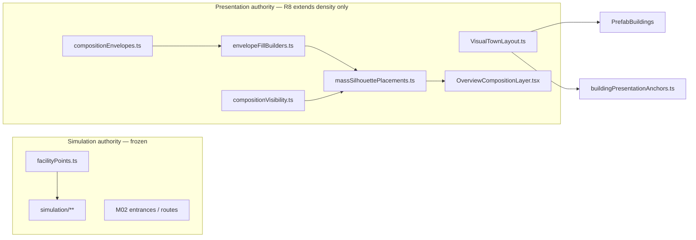

# WF02 Plan Revision 8 — Visual Vocabulary & Composition-Density Redesign

**State:** WAITING_FOR_CHATGPT_PLAN_APPROVAL  
**Supersedes:** Plan revision 7.1 (`Docs/milestones/WF02/PLAN_R7_1.md`)  
**Investigation base SHA:** `1f8f0337423e4dd67babc80c4429e056fe63d2f9` (WF02-R71-PHASE1 blocked)  
**Pixel evidence SHA:** `6dcd830c5861eec56fe8e2eeb10bf9f6720e0f7a` (`review-evidence-wf02-r71-6dcd830`)  
**Branch:** `cursor/wf02-scale-calibration-754a`  
**Scope:** PLAN ONLY — no production code, asset import/repack, evidence capture, merge, or M03 until `[GOD-MODE:CHATGPT-PLAN-DECISION] Decision: APPROVED_TO_BUILD`

---

## 1. Work item

WF02 — North-Star Scale & Aesthetic Calibration (presentation-only; simulation truth frozen underneath).

---

## 2. Decision context

| Review | SHA | Gate | Lesson |
|---|---|---|---|
| WF02-003 (R4.1) | `6dbd8b5` | BLOCKED | Orchestrator correct; scatter/tint insufficient |
| WF02-004 (R5.1) | `fa64055` | BLOCKED | High-poly Quaternius at Overview ceiling; empty orchard/park |
| WF02-005 (R6) | `743a259` | BLOCKED | MSS recovered budget; image-space unchanged |
| WF02-R71-PHASE0 | `a13a581` | Prototype approved | Composited overlay proved **where** mass should exist |
| WF02-R71-PHASE1 | `1f8f033` / evidence `6dcd830` | **BLOCKED** | **6th consecutive visual hard-gate failure** — scaffolding without final pixel density |
| ChatGPT FIX_REQUIRED | `1f8f033` | **Plan R8 required** | Vocabulary + composition-density redesign — not R7.2 tuning |

**Engineering preserved @ `1f8f033` (must not regress):**

| Check | Result |
|---|---|
| Unit + integration + e2e + build | **190/190 PASS** |
| Asset/network errors | **0** |
| `facilityPoints.ts` / `simulation/**` | Frozen (0-byte diff vs Phase 0) |
| Overview live GL | **123 DC / 56,708 tris** |
| Street live GL | **82 DC / 93,264 tris** |
| Store↔workshop visual AABB gap | **0.52 m** ✅ |
| `VisualTownLayout` 14/14 mappings | Within maxOffset ✅ |

**Visual failure (ChatGPT + Grok agree):** Actual Overview/Angled engine pixels remain confusable with blocked R6 — isolated facilities on a flat green board. Civic, residential, commercial/work, orchard/farm, and river/park do not form legible district masses at the frozen Overview camera.

---

## 3. Executive summary — R8 is not tuning

R8 is an explicit **visual vocabulary + composition-density redesign**. After six blocks, another point-count/scale/tint patch under the same lightweight-decoration model is **prohibited**.

### Build Path P-VCD (Visual Vocabulary + Composition Density — mandatory)

| Phase | Name | Deliverable | Gate |
|---|---|---|---|
| **0a** | Registered inventory vs north-star roles | Kenney + Quaternius role matrix; genuine gaps named with exact paths | No invented asset names |
| **0b** | **Engine-rendered representative slice proof** | Civic + adjacent residential/commercial at frozen Overview/Angled with **final intended density vocabulary** | ChatGPT slice decision — fail → STOP, no 240 m propagation |
| **1** | District mass vocabulary rollout | Large readable masses via instanced vetted geometry + revised visibility | Per-district image-space targets (§9) |
| **2** | Optional bounded imports | Kenney suburban detail singles and/or one optional external family (§6) — only if 0b proves need | Each row in `ASSET_REGISTER.md` before use |
| **3** | Full integration + corrected evidence | R6→R8→north-star compare; fixed time-of-day semantics (§15.4) | VST-R8 stop tests + Grok review |

**Rejected without new plan revision:** R7.2 envelope spacing tweaks; quota-only count bumps; greyscale-only acceptance; composited overlay as visual PASS; spending recovered triangle budget without image-space proof; broad 240 m implementation before 0b slice PASS; optimizing Overview back into emptiness to save DC.

**Preserved from R7.1 Phase 1:** `VisualTownLayout` authority separation; bounded presentation mapping; recovered performance headroom; deterministic worker-authoritative simulation; single `OverviewCompositionLayer` orchestrator; warm atlas @ R5.1.

---

## 4. Root cause — why R7.1 Phase 1 failed visually

### 4.1 Dominant failure mode

Phase 1 converted the Phase 0 composited prototype into **runtime scaffolding** but kept the visual vocabulary calibrated as **lightweight decoration**:

- Hero-core polygons exist mathematically (110 m × 90 m) but **do not occupy enough image space** to read as town composition.
- KCC/CVP fills pass count minimums (e.g. civic plaza CVP ≥20, orchard KCC ≥40) but instances are **too small, too low, too discontinuous** at Overview distance.
- The 14 Kenney buildings remain **visually isolated**; envelope fills read as terrain-adjacent noise, not district structure.
- Outer 240 m board still reads as **undifferentiated green** except for sparse facility dots.

### 4.2 Why Phase 0 → Phase 1 did not close the gap

| Phase 0 proved | Phase 1 shipped | Gap |
|---|---|---|
| **Where** mass should exist (composited overlays) | Bounded offsets + envelope tables | Overlay density ≠ runtime primitive readability |
| Civic warm pad + colonnade ring | 143 CVP plaza + 32 KCC colonnade @ scale 0.62–1.14 | CVP blobs merge with ground; trees are 42-tris Kenney specks |
| Orchard solid block | 61 KCC treeSmall @ spacing 2.2 | Block math exists; screen footprint still dispersed dots |
| Residential cluster bands | 21 CVP garden offsets | Far below midground mass needed in prototype |
| Periphery forest wall | 74 KCC frame | Present but thin vs north-star tree belts |

**Fundamental failure:** Phase 0 accepted **pixel-painted** mass; Phase 1 never proved that the **registered runtime assets + instancing strategy** could produce equivalent mass at frozen cameras before propagating across the hero core.

### 4.3 `compositionVisibility.ts` starvation

`baselineVegetation` (Quaternius M02/riverbank accents) is **excluded from Overview/Angled** — correct for high-poly cost, but the **replacement** Kenney/CVP mass is too sparse to compensate.

Current tier map (`src/rendering/environment/compositionVisibility.ts`):

| Tier | Overview/Angled | Street+ | R8 issue |
|---|---|---|---|
| `core` | ✅ | ✅ | Buildings only — insufficient alone |
| `baselineVegetation` | ❌ | ✅ | Excluded — no Overview replacement at equal readability |
| `district` | ✅ | ✅ | KCC street trees (11) too few |
| `orchard` | ✅ | ✅ | KCC block under-scaled for screen |
| `park` | ✅ | ✅ | CVP promenade low/conflat |
| `periphery` | ✅ | ✅ | Frame exists but does not read as intentional countryside |

R8 must **explicitly decide** what vegetation/massing appears at Overview/Angled and **why**, using instancing/shared materials/LOD — not starve Overview merely to optimize draw calls.

---

## 5. Simulation vs presentation (unchanged authority model)

**Rule:** Keep `VisualTownLayout.ts` as the presentation transform boundary. R8 reworks fill builders, visibility tiers, and mounted layers around **large readable district masses** — not isolated decoration points.

---

## 6. Registered asset inventory vs north-star roles

Audit base: `Docs/milestones/WF02/KENNEY_INVENTORY_AUDIT_R71.md`, `Docs/assets/ASSET_REGISTER.md`, on-disk `public/assets/glb/kenney/**`, `public/assets/gltf/quaternius/**`.

### 6.1 Role matrix — on-disk assets

| North-star role | Required read @ Overview | Exact registered asset paths | Gap |
|---|---|---|---|
| **Hero civic silhouette** | Dominant warm civic anchor + plaza hierarchy | `commercial/community-hall.glb`, `commercial/school.glb`, `commercial/clinic.glb` | Buildings OK; **plaza mass + center anchor missing** — no fountain/bench on disk |
| **Civic plaza / colonnade** | Warm pad + ring framing square | CVP (`CanopyVolumeLayer`) + `suburban/tree-large.glb` KCC | CVP too flat; tree-large **42 tris** — insufficient vertical silhouette |
| **Residential mass** | Midground cluster band, garden edges | `suburban/home-*.glb`, `suburban/apartment-block.glb`, `suburban/fence-low.glb`, CVP garden fills | Buildings OK; **cluster canopy/hedge mass** too sparse |
| **Commercial/work frontage** | Continuous street edge + rhythm | `commercial/store-general.glb`, `commercial/cafe-bistro.glb`, `industrial/workshop-industrial.glb`, `commercial/detail-awning.glb`, `commercial/detail-parasol-a.glb` | Frontage **continuity** missing — no lamp-post; awning/parasol alone insufficient |
| **Orchard/farm block** | Solid rectangular canopy block + field band | `suburban/tree-small.glb` KCC, CVP field band, `suburban/farmhouse.glb` | Grid math exists; **screen-solid block** not achieved at current scale/spacing |
| **River/park edge** | U-frame promenade + bank vegetation | CVP park-u-frame, `suburban/tree-large.glb` KCC arc, Quaternius `RIVERBANK_VEGETATION` (Street-only today) | Park mass low; riverbank accents **invisible at Overview** |
| **Tree belts / periphery** | Intentional forest/farm horizon | `suburban/tree-large.glb`, `suburban/tree-small.glb` KCC periphery frame | Frame counts OK (74 KCC) but **image-space coverage** insufficient |
| **Paths / fences / props** | Legible garden/path edges | `suburban/path-short.glb`, `suburban/path-long.glb`, `suburban/fence-low.glb`, `suburban/driveway-short.glb` | Paths registered but **not used** in hero-core massing; fence-low under-deployed |
| **Roads / bridge** | Frozen topology spine | `roads/road-*.glb` (7 variants) | ✅ Sufficient |
| **M02 + citizen** | Street-scale readability | `characters/alex-character.glb`, M02 trio buildings | ✅ Frozen |

### 6.2 Quaternius inventory (registered, CC0)

| Asset key | Path | Tris (approx) | Current Overview use |
|---|---|---:|---|
| commonTree1/2 | `/assets/gltf/quaternius/CommonTree_*.gltf` | ~800–1200 each | **Excluded** Overview (`baselineVegetation`) |
| pine1/2 | `/assets/gltf/quaternius/Pine_*.gltf` | ~600–900 | **Excluded** Overview |
| bush, bushFlowers, fern, flowers | `/assets/gltf/quaternius/Bush_*.gltf`, etc. | ~100–400 | Street/M02/river only |
| pebble1/2 | `/assets/gltf/quaternius/Pebble_*.gltf` | ~20 | Riverbank accent |

**R8 decision required:** Quaternius full meshes remain **too expensive** for dense Overview instancing (R5.1 lesson). Options: (a) **do not restore** raw Quaternius at Overview; (b) optional **baked impostor sprites** derived from Quaternius CC0 sources for belt mass only — counted in budget as ≤2 DC shared material.

### 6.3 Kenney CC0 gaps — exact originals NOT on disk

These exist in **Kenney City Kit Suburban 2.0** (same CC0 vendor — not external). Import deferred until Phase 0b/ChatGPT approves exact rows:

| Kenney original | Proposed path | Role | Est. tris | Est. DC @ Overview |
|---|---|---|---:|---:|
| `detail-bench.glb` | `suburban/detail-bench.glb` | Civic plaza seating silhouette | 24 | 1 instanced |
| `detail-fountain.glb` | `suburban/detail-fountain.glb` | Square center civic anchor | 80 | 1 instanced |
| `lamp-post.glb` | `suburban/lamp-post.glb` | Commercial frontage rhythm | 36 | 1 instanced |
| `path-round.glb` | `suburban/path-round.glb` | Plaza/promenade edge | 12 | 1 instanced |
| `bush-large.glb` | `suburban/bush-large.glb` | Residential garden band | 48 | 1 instanced |

**Legal:** CC0 1.0 via https://kenney.nl/assets/city-kit-suburban — same pack as existing suburban imports.

### 6.4 Optional ONE external asset migration (conditional — not authorized)

**Trigger:** Phase 0b engine slice fails to reach §9 civic/residential image-space targets using **scaled Kenney KCC + CVP + §6.3 singles only**.

**Proposed family (single coherent option for ChatGPT evaluation):**

| Field | Value |
|---|---|
| Family | **Kenney Nature Kit** (CC0 1.0) |
| Source | https://kenney.nl/assets/nature-kit |
| License | CC0 1.0 — verified before download |
| Rationale | Registered `tree-small`/`tree-large` (42 tris each) cannot produce overview-scale canopy **volume** even at high instance counts; Nature Kit provides larger low-poly tree/bush/rock silhouettes purpose-built for environment framing |
| Import scope (max) | ≤4 GLBs: one broad-canopy tree, one conifer, one bush cluster, one rock — **presentation instancing only** |
| Normalization | `targetWidth` / height cap per asset; warm atlas tint pass optional offline (same R5.1 pipeline) |
| Expected cost | +4–8 DC / +6k–14k tris at Overview if ≤80 instances total |
| Rollback | Remove registry entries + mass builder tables; revert to Kenney-only KCC |

**Do not import before `[GOD-MODE:CHATGPT-PLAN-DECISION]`.** If Kenney suburban singles + density pass suffice, **skip §6.4 entirely**.

---

## 7. Phase 0b — engine-rendered representative composition proof (mandatory gate)

Before any broad 240 m rollout, R8 requires one **engine-rendered slice** at frozen cameras using the **final intended density vocabulary**.

### 7.1 Slice bounds (world X/Z)

| Zone | Bounds | Must demonstrate |
|---|---|---|
| Civic core | x ∈ [−40, −8], z ∈ [−28, 8] | Warm plaza pad, colonnade/tree ring, community-hall + school silhouette hierarchy, radial paths |
| Commercial frontage | x ∈ [−36, 4], z ∈ [0, 24] | Store + cafe + workshop **continuous frontage band**; M02 attachment plausibility preserved |
| Residential adjacency | x ∈ [8, 52], z ∈ [−32, −4] | Cluster midground mass, fence/path edges, future-lot negative space |

### 7.2 Proof deliverables (Phase 0b STOP)

| Artifact | Path | Method |
|---|---|---|
| Slice Overview 06:00 | `Docs/milestones/WF02/r8_slice_overview_dawn.png` | **Real engine** @ frozen Overview camera |
| Slice Overview 12:00 | `Docs/milestones/WF02/r8_slice_overview_noon.png` | **Real engine** — verified clock (§15.4) |
| Slice Angled | `Docs/milestones/WF02/r8_slice_angled.png` | **Real engine** @ frozen Angled camera |
| Slice compare strip | `Docs/milestones/WF02/compare_r6_slice_northstar_r8.png` | R6 blocked → R8 slice → north star |
| Slice manifest | `Docs/milestones/WF02/r8_slice_manifest.json` | DC/tris, instance counts, simMinute clock labels |

**STOP fork:** If slice cannot materially approach north-star family on civic plaza hierarchy + tree framing + frontage continuity, **do not propagate** to full hero core. Revise vocabulary (§6) and re-run 0b.

**Explicitly not acceptable:** SVG/composited overlay, greyscale mock, or count-table PASS without pixel proof.

---

## 8. Image-space / coverage targets per district (measurable)

Counts alone insufficient. Each target includes **approximate Overview frame coverage** (1440×900, frozen camera) and **vertical mass hierarchy**.

| District | Overview frame coverage target | Vertical / hierarchy target | Negative-space boundary |
|---|---|---|---|
| **Civic plaza** | Warm ground + mass ≥ **8–12%** of hero-core footprint in frame | Plaza center ≥ **1.5×** nearest cottage roof height (fountain/colonnade or approved substitute); radial path arms visible | Main cross roads remain clear — no mass through road mesh |
| **Civic colonnade ring** | Tree/arch mass encircles ≥ **60%** of plaza perimeter in frame | Kenney tree-large **scaled 2.5–3.5×** or Nature Kit equivalent; CVP embankment **0.8–1.2 m** apparent height | Inset ≥3 m from road centerlines |
| **Residential cluster** | Midground band occupies ≥ **18–25%** of hero-core width | Fence-low + garden CVP + street trees form **continuous** L-shape around houses; houses remain readable | Future-lot row stays visibly **empty** (designed void) |
| **Commercial/work frontage** | Shrub/tree/lamp band ≥ **6–10%** strip along commercial edge | Store/workshop doors visually anchored to frontage band; **0.52 m** store↔workshop gap preserved | No phantom buildings on future lots |
| **Orchard block** | Solid canopy ≥ **10–14%** of NE farm quadrant | **≥4 rows × ≥6 columns** apparent block; spacing ≤1.8 m; scale 1.2–1.6× tree-small | Field band CVP outside block, not inside |
| **River/park U-frame** | Park promenade visible on ≥ **2 of 3** U legs @ Overview | CVP promenade + tree arc **connect** visually to river edge | River water plane unobstructed |
| **Periphery / outer world** | Tree belt ≥ **5–8%** top/side frame edge | Reads as **forest/farm horizon**, not random dots | Founder meadow remains intentional void with edge accents only |
| **Background hierarchy** | 3 readable planes: foreground paths, midground districts, background orchard/periphery | Foreground saturated detail; background cooler/lighter | Outer z > 65 reads countryside, not unused board |

**Verification:** `scripts/wf02-r8-coverage-audit.mjs` (new) samples labeled ROI masks on captured PNGs — supporting evidence only; human ordinary-viewer judgment remains authoritative.

---

## 9. `compositionVisibility.ts` — proposed R8 policy

### 9.1 Problem statement

Current policy excludes `baselineVegetation` from Overview/Angled without providing equal-or-better **instanced** replacement, yielding an empty-overview failure mode.

### 9.2 Proposed tier decisions (for ChatGPT approval)

| Tier | R7.1 Phase 1 | R8 proposal | Rationale |
|---|---|---|---|
| `baselineVegetation` | Street+ only | **Replace, do not restore raw Quaternius at Overview** | Cost lesson from R5.1 |
| `overviewMassing` (new) | n/a | Overview + Angled + key aux presets | Dedicated Kenney KCC + CVP + optional impostor belts |
| `district` | Overview+ | Overview+ with **2–3× instance density** | Midground cluster readability |
| `orchard` | Overview+ | Overview+ with **block-solid instancing** | Farm hero read |
| `park` | Overview+ | Overview+; merge riverbank accent as **instanced low-cost** | Park/river edge continuity |
| `periphery` | Overview+ | Overview+; **double frame density** | Intentional countryside |
| `streetDetail` (new) | Street/M02/attachments only | Quaternius + parasol/awning + lamps | High-detail near-camera only |

### 9.3 Budget coupling

Increasing Overview visibility is allowed **only with**:

- Shared materials (CVP ≤2 materials, KCC instancing ≤3 draw calls)
- Optional impostor belt ≤2 DC
- Hard cap: Overview ≤**135 DC** / ≤**118k tris** with ≥5 DC + ≥8k tris M03 reserve

**Forbidden:** deleting Overview mass to recover DC without matching image-space PASS on slice 0b.

---

## 10. Hero core vs outer 240 m world

| Zone | World bounds (x, z) | R8 intent |
|---|---|---|
| **Hero core** | [−55, 55] × [−55, 35] (~110×90 m) | **Perceived ~100–140 m** inhabited miniature town — all §8 targets apply |
| **Mid landscape** | z ∈ [35, 65], river edge | Park U-frame, farm approach, embankment skirts |
| **Outer authored** | z > 65, periphery z < −70, east expansion | **Intentional** orchard block, forest belt, river corridor, expansion meadow — not undifferentiated green |

Designed voids (from R7.1, retained):

| Void | Treatment |
|---|---|
| founder-meadow | Warm grass + sparse edge trees only |
| main-cross | Road/sidewalk authority clear |
| river-corridor | Water + bank vegetation frame |
| expansion-east | Meadow + distant tree accents |

---

## 11. Fourteen-building scale table (frozen)

### 11.1 `targetWidth` (unchanged @ R2)

| buildingId | targetWidth (m) | GLB |
|---|---:|---|
| house-1 | 11.2 | `suburban/home-cottage.glb` |
| house-2 | 11.0 | `suburban/home-type-a.glb` |
| house-3 | 11.0 | `suburban/home-type-c.glb` |
| house-4 | 11.2 | `suburban/home-type-d.glb` |
| apartment | 16.0 | `suburban/apartment-block.glb` |
| community-hall | 16.0 | `commercial/community-hall.glb` |
| clinic | 13.5 | `commercial/clinic.glb` |
| school | 17.5 | `commercial/school.glb` |
| store | 13.5 | `commercial/store-general.glb` |
| cafe | 12.2 | `commercial/cafe-bistro.glb` |
| workshop | 15.0 | `industrial/workshop-industrial.glb` |
| warehouse | 19.0 | `industrial/warehouse.glb` |
| utility | 13.5 | `industrial/utility-station.glb` |
| farmhouse | 12.5 | `suburban/farmhouse.glb` |

### 11.2 `VisualTownLayout` presentation centers (frozen @ R7.1)

| facilityId | visualCenter (x,z) | rotationΔ | maxOffsetM |
|---|---|---:|---:|
| community-hall | (−16, −14) | 0 | 6 |
| clinic | (−38, −12) | −0.03 | 6 |
| school | (−22, −44) | 0 | 6 |
| house-1 | (14, −8) | 0 | 4 |
| house-2 | (28, −10) | 0.06 | 4 |
| house-3 | (14, −28) | 0 | 4 |
| house-4 | (28, −28) | −0.04 | 4 |
| apartment | (46, −20) | 0.04 | 8 |
| store | (−10, 6) | 0 | 5.5 |
| cafe | (−28, 10) | 0.05 | 5 |
| workshop | (−10, 20) | −0.03 | 5 |
| warehouse | (−36, 42) | 0 | 8 |
| utility | (−48, 28) | −0.05 | 8 |
| farmhouse | (32, 68) | 0 | 16 |

### 11.3 M02 attachment audit (frozen)

| Check | Value | Gate |
|---|---:|---|
| store↔workshop visual AABB gap (Z) | **0.52 m** | ✅ |
| store entrance → visual AABB | −5.15 m | attachment plausibility |
| workshop entrance → visual AABB | −6.53 m | attachment plausibility |
| All 14 within maxOffset | true | ✅ |

### 11.4 Citizen / door / road proportions (frozen)

| Element | Presentation | Simulation |
|---|---:|---:|
| Citizen height | **2.32 m** | **1.8 m** |
| Door target | ~1× citizen presentation height | — |
| Road width | **6.0 m** | authoritative topology |
| Sidewalk | **1.4 m** | presentation band |
| Path | **1.6 m** | M02 routes |

### 11.5 Cameras (frozen)

| Preset | position | target |
|---|---|---|
| Overview | `[10, 93, 54]` | `[30, 2, 4]` |
| Angled | `[68, 53, 37]` | `[28, 3, 2]` |

Evidence: 1440×900 viewport, FOV 45°.

---

## 12. Recommended implementation direction (plan evaluation — not authorization)

Keep `VisualTownLayout.ts` as presentation transform boundary. Rework:

| Module | R8 direction |
|---|---|
| `compositionEnvelopes.ts` | Tighten slice polygons for 0b; full hero core unchanged bounds |
| `envelopeFillBuilders.ts` | **Scale + spacing + continuity** redesign; multi-row orchard; plaza concentric rings; shared instancing keys |
| `massSilhouettePlacements.ts` | Tier-aware density tables; separate `overviewMassing` builder |
| `compositionVisibility.ts` | §9 policy — stop Overview starvation |
| `CanopyMassing.tsx` / `CanopyVolumeLayer.tsx` | Larger apparent mass; material batching |
| `OverviewCompositionLayer.tsx` | Mount path/fence instancing bands; optional impostor belt component |
| `PresentationTerrainLayer.tsx` | Support only — **cannot substitute** for silhouettes |

Prefer **shared/instanced vetted geometry** over generic boxes. Spend recovered triangle budget deliberately (Overview target ≤125 DC, hard ≤135 DC).

---

## 13. File map (planned touch surface post-approval)

| Path | Role |
|---|---|
| `src/rendering/environment/VisualTownLayout.ts` | **Preserve** — presentation mapping authority |
| `src/rendering/environment/compositionEnvelopes.ts` | Slice + hero envelopes |
| `src/rendering/environment/envelopeFillBuilders.ts` | Density vocabulary |
| `src/rendering/environment/massSilhouettePlacements.ts` | Tier builders |
| `src/rendering/environment/compositionVisibility.ts` | Overview visibility policy |
| `src/rendering/environment/OverviewCompositionLayer.tsx` | Layer orchestration |
| `src/rendering/environment/CanopyMassing.tsx` | KCC instancing |
| `src/rendering/environment/CanopyVolumeLayer.tsx` | CVP batches |
| `src/rendering/environment/PresentationTerrainLayer.tsx` | Embankment support |
| `src/rendering/assets/EnvironmentAssetRegistry.ts` | Optional new asset keys |
| `scripts/wf02-r8-slice-capture.mjs` | Phase 0b engine slice evidence |
| `scripts/wf02-r8-coverage-audit.mjs` | ROI coverage audit |
| `scripts/capture-wf02-evidence.mjs` | Fix time-of-day semantics (§15.4) |
| `tests/unit/wf02/**` | Visibility, density, audit tests |
| `Docs/assets/ASSET_REGISTER.md` | Provenance before any import |
| `Docs/milestones/WF02/PLAN_R8.md` | This plan |

**Do not touch:** `src/simulation/**`, `src/world/facilityPoints.ts`, M02 route/entrance semantics, road/river topology, M03 gameplay.

---

## 14. Rollback

| Boundary | Rollback |
|---|---|
| Phase 0b slice only | Remove slice builders; no production town impact |
| Phase 1 density rollout | Revert `envelopeFillBuilders` + visibility tables to `1f8f033` |
| Optional Kenney singles | Delete GLBs + registry rows |
| Optional Nature Kit | Delete import folder + impostor materials |
| Performance over cap | Prune order: periphery accents → future-lot fill −50% → optional props −50% — **never** civic/commercial/orchard hero first |

---

## 15. M2 / 8 GB performance budget

| Gate | Target | Hard cap | M03 reserve |
|---|---:|---:|---|
| Overview DC | ≤**125** | ≤**135** | ≥**5 DC** |
| Overview tris | ≤**100,000** | ≤**118,000** | ≥**8,000 tris** |
| Street DC | ≤**85** | ≤**100** | — |
| CVP materials | ≤2 DC | ≤3 DC | shared batches |
| KCC instancing | ≤3 DC | ≤4 DC | tree-small/large keys |
| Optional impostor belt | ≤2 DC | ≤2 DC | only if §6.4 approved |

**Discipline:** Phase 0b slice measured first. Full town must not exceed hard cap. Do not optimize back into emptiness.

---

## 16. Evidence plan

### 16.1 Compare chain (frozen camera)

| Panel | Source |
|---|---|
| R6 blocked BEFORE | `review-evidence-wf02-r6-743a259` |
| R7.1 Phase 1 blocked | `review-evidence-wf02-r71-6dcd830` |
| R8 slice (Phase 0b) | `Docs/milestones/WF02/r8_slice_*.png` |
| R8 build AFTER | `review-evidence-wf02-r8-<sha>` |
| NORTH STAR | `Docs/art-direction/references/god-mode-town-north-star.png` |

Primary acceptance: Overview **06:00** gameplay @ implementation SHA — ordinary viewer must **not** confuse with R6/R7.1.

### 16.2 Required shots @ implementation SHA

Overview dawn/noon, Angled, civic, residential/future lots, commercial/work, farm/orchard, river/park, Street citizen+door+road/sidewalk, store/workshop attachments, morning/noon/night, diagnostics manifest, **0** asset/network errors, full `npm run test:all`.

### 16.3 Scripts

| Script | Role |
|---|---|
| `scripts/wf02-r8-slice-capture.mjs` | Phase 0b representative slice |
| `scripts/wf02-r8-coverage-audit.mjs` | ROI coverage metrics |
| `scripts/capture-wf02-evidence.mjs` | Full evidence + compare strip |
| `scripts/wf02-r71-composition-audit.mjs` | M02 gap + offset regression |

### 16.4 Deterministic time-of-day capture procedure (mandatory fix)

**Bug @ R7.1 evidence:** `WORLD_START_OFFSET_MINUTES = 360` maps simMinute to display clock. Current capture script mislabels shots:

| Label | Current simMinute | Actual clock | Correct simMinute |
|---|---:|---|---:|
| `01_wf02_overview_dawn` | 360 | **12:00 noon** ❌ | **0** → 06:00 |
| `01b_wf02_overview_noon` | 720 | **18:00 evening** ❌ | **360** → 12:00 |
| Night (~20:30) | 1230 | **02:30** ❌ | **870** → 20:30 |

**R8 procedure:**

1. Before each capture, call `stepToSimMinute(target)` from simMinute **0** baseline (or reset evidence session).
2. Assert `deriveCalendar(simMinute).clockLabel` in manifest metadata per shot.
3. Reject manifest if label/clock mismatch.
4. Required times: **06:00** (dawn gameplay default), **12:00** (noon palette), **~20:30** (night practicals).

Formula: `simMinute = (hour * 60 + minute) - WORLD_START_OFFSET_MINUTES`.

---

## 17. Do-not-touch list

| Path / rule | Reason |
|---|---|
| `src/simulation/**` | WF02 presentation-only |
| `src/world/facilityPoints.ts` | Sim anchor authority |
| M02 logical entrances/routes | Worker/pathfinding truth |
| Road topology, river carve, `terrainHeightAt` | Geography frozen |
| R2 `targetWidth`, 2.32/1.8 m citizen split | Scale frozen |
| Overview/Angled camera constants | Evidence chain |
| Warm atlas repack @ R5.1 | Frozen palette baseline |
| M03 gameplay / 20-citizen spawn | Out of scope |
| Enterable interiors / household/sleep | Out of scope |
| Runtime LLM / paid AI APIs | Constitution forbidden |

---

## 18. Stop condition (this document)

**State: WAITING_FOR_CHATGPT_PLAN_APPROVAL**

- Plan R8 posted @ branch head — **no R8 implementation**
- **No asset import**
- **No merge**
- **No M03**

Awaiting:

`[GOD-MODE:CHATGPT-PLAN-DECISION] Decision: APPROVED_TO_BUILD` (scope: Phase 0b slice first, then phased rollout per §3)

---

## 19. Requirement IDs protected

WF02-VIS-001 (image-space north-star family), WF02-SCL-002 (citizen/door/road proportions), WF02-AUTH-003 (sim/presentation separation), WF02-PERF-004 (M2/8GB gates + M03 reserve), SIM-TIME-001 (deterministic clock evidence).
