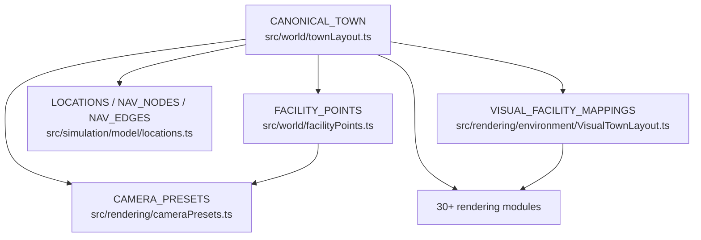

# WF02 Plan Revision 9 — World Composition Reset (World Lab)

**State:** WAITING_FOR_CHATGPT_PLAN_APPROVAL  
**Supersedes:** Plan revision 8 (`Docs/milestones/WF02/PLAN_R8.md`)  
**Investigation base SHA:** `33ede62403f320badd55e2eb69e594698a202c5b` (WF02-R8-PHASE0B blocked)  
**Pixel evidence SHA:** `314d57cc088b75c1a837ceb08877955e36c748da` (`review-evidence-wf02-r8-slice-314d57c`)  
**Branch:** `cursor/wf02-scale-calibration-754a`  
**Scope:** PLAN ONLY — no production code, asset import/repack, evidence capture, merge, or M03 until `[GOD-MODE:CHATGPT-PLAN-DECISION] Decision: APPROVED_TO_BUILD`

---

## 1. Work item

WF02 — North-Star Scale & Aesthetic Calibration.

After seven consecutive visual hard-gate failures (R2–R8), the remaining blocker is **not** decoration density, palette, or presentation offset tuning on the existing 240 m geography. R9 proposes a **World Composition Reset**: decouple deterministic simulation semantics from the historical placeholder world skeleton, author one real-engine **~60–80 m hero neighborhood** first, and prove north-star family composition there before any 240 m expansion.

---

## 2. Decision context

| Review | SHA | Gate | Lesson |
|---|---|---|---|
| WF02-003 (R4.1) | `6dbd8b5` | BLOCKED | Orchestrator correct; scatter/tint insufficient |
| WF02-004 (R5.1) | `fa64055` | BLOCKED | High-poly Quaternius at Overview ceiling; empty orchard/park |
| WF02-005 (R6) | `743a259` | BLOCKED | MSS recovered budget; image-space unchanged |
| WF02-R71-PHASE0 | `a13a581` | Prototype approved | Composited overlay proved **where** mass should exist |
| WF02-R71-PHASE1 | `1f8f033` / `6dcd830` | BLOCKED | Scaffolding without final pixel density |
| WF02-R8-PHASE0B | `33ede62` / evidence `314d57c` | **BLOCKED** | **7th consecutive visual hard-gate failure** — high-density slice still confusable with R6/R7 failure class |
| ChatGPT FIX_REQUIRED | `33ede62` | **Plan R9 required** | Root-cause architecture/world-layout change — not R8.1 tuning |

**Engineering preserved @ `33ede62` (must not regress):**

| Check | Result |
|---|---|
| Unit + integration + e2e + build | **198/198 PASS** |
| Asset/network errors | **0** |
| `simulation/**` behavior/state/action semantics | Frozen |
| Worker authority / determinism | Frozen |
| R8 slice live GL (bounded zones) | Overview dawn **124 DC / 68,570 tris**; noon **121 DC / 68,234 tris** |
| R8 slice propagation estimate | Full-hero @ slice density ≈**298 DC** — **exceeds** 135 DC ceiling |

**Visual failure (ChatGPT + Grok agree):** Even the bounded R8 real-engine slice at final intended prop density remains visually confusable with the repeated R6/R7 failure class at Overview/Angled: isolated facilities, white road ribbons, dominant empty green board. Local prop density improved; **town composition did not**.

**Root cause (mentor brief):** An early placeholder world layout was hardened into product invariants before proving that layout could produce the north-star image. The current 240 m geography/facility-coordinate/road/composition constraints force every visual attempt to decorate the same skeleton. R8 confirms that even high-density slice work under that skeleton cannot produce the target image and cannot simply be propagated.

---

## 3. Executive summary — R9 is a World Composition Reset

R9 is **not** R8.1 density tuning, palette adjustment, or another presentation-offset patch on `CANONICAL_TOWN`.

### Build Path P-WCR (World Composition Reset — mandatory)

| Phase | Name | Deliverable | Gate |
|---|---|---|---|
| **0** | Dependency audit + World Lab scaffold | Semantic world-definition API spec implemented as read-only resolver; legacy layout flagged `deprecated` | Unit tests for resolver; zero sim behavior change |
| **1** | **Hero neighborhood prototype** (~60–80 m, 6–10 structures) | Real-engine coherent miniature town: civic square, residential cluster, commercial/work frontage, paths/roads, vegetation, optional river edge | ChatGPT neighborhood gate — fail → STOP, no 240 m expansion |
| **2** | Asset gap resolution (conditional) | If Phase 1 audit proves Kenney silhouettes are limiting vocabulary: import **one** vetted modular architectural family (plan-approved only) | Each row in `ASSET_REGISTER.md` before use |
| **3** | Simulation coordinate migration | M02 semantic IDs resolve through world-definition layer; nav graph derived from prototype layout | Route/entrance determinism tests green |
| **4** | 240 m expansion (deferred) | Only after Phase 1 PASS + Phase 3 migration proven | Separate plan revision required |

**Rejected without new plan revision:** R8.1 slice density propagation; whole-world rewrite before neighborhood PASS; another decoration pass on frozen 240 m skeleton; generic box-town filler; new asset family import before plan approval; M03 population work; merge.

**Preserved from all prior WF02 work:** deterministic worker-authoritative simulation; stable IDs/actions/time; tests and asset loader/error diagnostics; useful Kenney/Quaternius pipeline; M2/8 GB discipline; warm atlas derivatives; `OverviewCompositionLayer` orchestrator pattern (re-targeted to World Lab).

---

## 4. Root cause — why R2–R8 failed

### 4.1 Dominant failure mode

Every plan revision from R2 through R8 changed **symptom-level degrees of freedom** while preserving the same authoritative spatial skeleton:

| Degree of freedom changed | Skeleton preserved |
|---|---|
| Building `targetWidth` scale | 240 m `groundExtent`, facility x/z in `townLayout.ts` |
| Palette / warm atlas / ground tint | Square at `(0,0)`, river on east edge, radial road spine |
| Vegetation density (Quaternius → Kenney → CVP/KCC) | 14 facilities scattered across ~110 m hero core with large empty meadow |
| Presentation offsets (`VisualTownLayout`) | M02 house-1/store/workshop auth centers frozen since WF01 |
| Envelope fills / mass silhouettes / R8 slice density | Road topology, district arrangement, Overview camera framing |

**Result:** Engineering green on every attempt; image-space hard gate blocked seven times. Ordinary viewers can still mistake R4.1, R6, R7.1, and R8 slice Overview for the same sparse green board with facility dots.

### 4.2 R8 Phase 0b proof

R8 Phase 0b implemented the **highest density yet** in civic/residential/commercial bounded zones:

- 180 Kenney + 525 CVP instances in slice bounds
- 3× colonnade, dense CVP, fences, street trees, path-stones, planters
- Overview dawn **124 DC / 68,570 tris** (under budget)

**Yet:** Grok independently BLOCKED — slice still reads as isolated facilities on empty green board. Extrapolating slice density to full hero core ≈**298 DC** — cannot propagate without violating 135 DC ceiling.

**Conclusion:** The skeleton spacing (facilities ~20–40 m apart, roads as white ribbons through meadow, civic square disconnected from residential/commercial clusters) is the blocker. No amount of prop scatter fixes town **composition**.

### 4.3 Architectural mistake

`CANONICAL_TOWN` in `src/world/townLayout.ts` was authored as a **placeholder expansion shell** (WF01: 240 m plane, 14 buildings, radial roads) and then treated as immutable product truth. Simulation nav (`locations.ts`), presentation (`facilityPoints.ts`), cameras, composition masks, and 30+ rendering modules all **derive coordinates from this single file**.

The separation attempted in R7.1 (`VisualTownLayout` presentation offsets) only nudged GLB placement ±4–16 m — insufficient to change district arrangement or camera-readable town shape.

---

## 5. Current dependency map — fixed coordinate assumptions

### 5.1 Authoritative coordinate sources (today)



### 5.2 File-by-file dependency inventory

| File / module | Coordinate dependency | Semantic IDs used | R9 action |
|---|---|---|---|
| `src/world/townLayout.ts` | **Root** — all buildings, roads, paths, river, square, park, farm plots, vacant plots, terrain | Building IDs, area IDs | **Replace** with World Lab definition; legacy → `legacyTownLayout.ts` |
| `src/world/facilityPoints.ts` | Hardcoded entrance/interior x/z for M02 trio | `house-1`, `store`, `workshop` | **Migrate** to resolver-derived from world definition |
| `src/simulation/model/locations.ts` | `doorstepPoint()` reads `CANONICAL_TOWN.buildings[].position` | `home`, `store`, `work` | **Migrate** nav graph to world-definition resolver |
| `src/simulation/model/pathfinding.ts` | Consumes `NAV_NODES` / `NAV_EDGES` | Node IDs | **Re-derive** edges from prototype layout |
| `src/simulation/model/citizen.ts` | Spawns at `LOCATIONS.home.point` | `home` | **Resolve** via semantic location API |
| `src/simulation/model/decision.ts` | Routes via `ACTION_LOCATION` | Action types | **Unchanged** semantics; coordinates from resolver |
| `src/rendering/environment/VisualTownLayout.ts` | Auth + visual centers per building | 14 facility IDs | **Retire** offset table; world definition owns placement |
| `src/rendering/cameraPresets.ts` | Frozen Overview `[10,93,54]→[30,2,4]`, Angled `[68,53,37]→[28,3,2]` | View names | **Re-author** for hero neighborhood framing |
| `src/rendering/facilityStreetCamera.ts` | Derives from `facilityPoints` + building AABB | M02 trio | **Re-derive** from world definition entrances |
| `src/rendering/riverBridgeCamera.ts` | River geometry from `CANONICAL_TOWN.river` | — | **Re-author** if river edge included in prototype |
| `src/rendering/assets/buildings/buildingPrefabConfig.ts` | `pos(id)` from `CANONICAL_TOWN` | 14 building IDs | **Resolve** position from world definition |
| `src/rendering/environment/RoadNetwork.tsx` | `CANONICAL_TOWN.roads/sidewalks/paths` | Road segment IDs | **Re-author** from prototype road graph |
| `src/rendering/environment/TownLandscape.tsx` | `groundExtent`, river, terrain | — | **Scope** to hero neighborhood bounds first |
| `src/rendering/environment/compositionMask.ts` | Road/path/river exclusions from `CANONICAL_TOWN` | — | **Re-derive** masks from prototype |
| `src/rendering/environment/districtMassing.ts` | Vacant plots, district specs anchored to auth coords | District roles | **Re-author** district arrangement in prototype |
| `src/rendering/environment/massSilhouetteBuilders.ts` | Square, park, orchard, river, vacant plots | — | **Re-scope** to prototype districts |
| `src/rendering/environment/OverviewCompositionLayer.tsx` | Orchestrator — no direct coords | — | **Retarget** inputs to World Lab resolver |
| `src/rendering/environment/r8Slice*.ts` | R8 slice bounds tied to legacy civic/residential/commercial zones | — | **Delete** after World Lab supersedes |
| `src/rendering/Town.tsx` | Iterates all buildings from layout | Building IDs | **Filter** via active world definition |
| `src/rendering/FacilityInteractionSpots.tsx` | `FACILITY_POINTS` | M02 trio | **Resolve** via world definition |
| `src/app/App.tsx` | River frame vectors, portrait bounds | — | **Re-derive** from prototype |
| `tests/unit/townLayout.test.ts` | Asserts legacy coordinates | — | **Split** legacy + World Lab tests |
| `tests/unit/wf01/*.test.ts` | River/road topology on 240 m layout | — | **Preserve** as legacy regression suite |
| `tests/unit/m02/pathfinding.test.ts` | Nav paths on legacy graph | — | **Extend** with semantic resolver tests |
| `tests/unit/wf02/*.test.ts` | Visual offsets, composition, scale | — | **Rewrite** for World Lab invariants |

### 5.3 Implicit invariants currently baked in

| Invariant | Value today | Problem |
|---|---|---|
| Town extent | 240 m (`groundExtent: 120`) | Overview camera sees mostly empty meadow |
| Civic square | `(0, 0)` | Disconnected from community-hall visual mass at `(-16,-16)` |
| M02 store center | `(-11, 11)` | Sim doorstep `(-11, 5)` vs presentation entrance `(-11, 7.6)` — dual truth |
| M02 workshop center | `(-11, 23)` | Vertical stack with store — reads as isolated strip, not frontage |
| Road spine | Radial from square through white Kenney ribbons | Dominates image; no enclosed blocks |
| Residential cluster | 4 houses + apartment east of square | Sparse; large gaps between structures |
| Farm/orchard | `farmhouse` at `(28, 82)` — 82 m from origin | Barely visible at Overview; consumes hero core budget |
| Overview camera | Fixed since WF02 R2 | Framed for 240 m board, not miniature town |

---

## 6. Proposed semantic world-definition API

### 6.1 Design principle

**Simulation speaks semantic IDs; world definition speaks coordinates.**

Citizens, actions, and routes reference `home`, `store`, `work`, `community-hall`, etc. — never raw x/z. The world-definition layer resolves semantic IDs to coordinates, entrances, nav nodes, and presentation anchors. Changing world layout changes coordinates everywhere consistently without touching simulation behavior semantics.

### 6.2 Proposed module structure

```
src/world/
  worldDefinition.ts          # Active world selector + version
  worldLab/
    heroNeighborhood.ts         # Phase 1 prototype definition (~60–80 m)
  legacy/
    townLayout.ts               # Renamed current CANONICAL_TOWN (rollback)
  resolver/
    worldResolver.ts            # Semantic ID → coordinates/entrances/nav
    navGraphBuilder.ts          # Derive NAV_NODES/EDGES from definition
    entranceResolver.ts         # Derive FACILITY_POINTS from definition
  types.ts                      # Shared WorldDefinition, FacilitySpec, RoadSpec types
```

### 6.3 Core API (TypeScript sketch — plan only)

```typescript
/** Semantic facility reference — simulation-safe. */
export type SemanticFacilityId =
  | 'home'           // maps M02 house-1
  | 'store'
  | 'work'           // maps M02 workshop
  | 'community-hall'
  | 'house-2'
  | 'cafe'
  | 'clinic';        // prototype subset; expandable later

export interface WorldDefinition {
  id: string;
  version: number;
  bounds: { minX: number; maxX: number; minZ: number; maxZ: number };
  facilities: readonly FacilitySpec[];
  roads: readonly RoadSpec[];
  paths: readonly PathSpec[];
  districts: readonly DistrictSpec[];
  terrain: TerrainSpec;
  river?: RiverSpec;
  cameras: Record<string, CameraSpec>;
}

export interface FacilitySpec {
  semanticId: SemanticFacilityId;
  buildingId: string;           // Kenney prefab key
  footprint: { width: number; depth: number; height: number };
  center: Vec2;
  rotationY: number;
  entrance: { offset: Vec2; facingRadians: number };
  interior: Vec2;
  presentationSpot: Vec2;
  presentationKind: 'chair' | 'counter' | 'workbench';
  serves?: ActionType[];        // M02 action mapping
}

/** Single resolver entry point — all modules use this. */
export function resolveWorld(): WorldDefinition;
export function resolveFacility(id: SemanticFacilityId): FacilitySpec;
export function resolveNavGraph(): { nodes: Record<string, Vec2>; edges: ReadonlyArray<readonly [string, string]> };
export function resolveEntrance(id: SemanticFacilityId): Vec2;
export function resolveSimLocation(action: ActionType): Vec2 | null;
```

### 6.4 Migration strategy

| Step | Action | Sim behavior change |
|---|---|---|
| 1 | Introduce `worldDefinition.ts` + resolver; default = `legacy` | **None** — resolver returns current coordinates |
| 2 | Refactor `locations.ts` to call `resolveNavGraph()` | **None** if legacy definition byte-identical |
| 3 | Refactor `facilityPoints.ts` to call `resolveEntrance()` | **None** if legacy definition byte-identical |
| 4 | Switch active definition to `heroNeighborhood` behind `WORLD_LAB_MODE` flag | Coordinates change; semantics unchanged |
| 5 | Re-author cameras, roads, composition for hero neighborhood | Presentation only until step 4 |
| 6 | Remove `VisualTownLayout` offset table — world definition owns placement | Offsets become zero |
| 7 | Phase 1 gate PASS → commit hero neighborhood as default | Requires updated pathfinding tests |

### 6.5 Determinism guarantees

- World definition is **static authored data** — no runtime mutation, no `Math.random`.
- Nav graph built deterministically from definition at module load.
- Seeded RNG streams unaffected — world layout is not an RNG input today and must not become one.
- Save/replay/checkpoint: world definition `version` field recorded in save metadata; mismatch → explicit error.
- Route invariants preserved: citizen still walks graph edges to semantic destinations; pathfinding algorithm unchanged.

---

## 7. Retired vs retained spatial invariants

### 7.1 Retired (R9 Phase 1)

| Invariant | Reason |
|---|---|
| 240 m `groundExtent` as default playable/rendered world | Proved to produce empty-board Overview |
| Square at `(0, 0)` as civic anchor | Disconnected from actual civic mass |
| Radial road spine from central square | White ribbons through meadow — not town blocks |
| 14-facility scatter across 110 m hero core | Too sparse for north-star miniature town read |
| `VisualTownLayout` presentation offset table | Symptom patch; world definition replaces it |
| Frozen Overview `[10,93,54]` / Angled `[68,53,37]` for 240 m board | Re-author for ~60–80 m neighborhood |
| R8 slice mode / density builders | Superseded by World Lab prototype |
| `farmhouse` at z=82 in hero framing | Outside meaningful Overview composition |
| Dual sim/presentation coordinate truth (store doorstep vs entrance) | Resolver single-sources both |

### 7.2 Retained

| Invariant | Reason |
|---|---|
| Semantic facility IDs (`home`, `store`, `work`, building IDs) | Simulation and save compatibility |
| M02 action → location mapping (`sleep/eat/work` → semantic IDs) | Core gameplay loop |
| 2.32 m visual / 1.8 m simulation citizen split | Proven scale calibration |
| Door ~1× citizen height; road 6 m / sidewalk 1.4 m / path 1.6 m | R4.1 proportion audit |
| Kenney roads/props pipeline where useful | CC0, proven loader, instancing |
| Quaternius/Kenney nature for vegetation | CC0, instancing strategy |
| Warm atlas derivatives (R5.1) | Palette progress — apply to new layout |
| `OverviewCompositionLayer` orchestrator pattern | Correct architecture; re-target inputs |
| Worker authority, deterministic time, action semantics | Constitution non-negotiable |
| Zero paid AI/LLM runtime | Constitution non-negotiable |
| `facilityPoints.ts` SHA256 regression guard (during legacy mode) | Until migration step 4 explicitly updates |

---

## 8. Hero neighborhood prototype — exact bounds

### 8.1 Scope

| Parameter | Value |
|---|---|
| Footprint | **~70 m × 65 m** (authoritative bounds box) |
| Structures in prototype | **8** (6–10 range; 8 chosen for M02 coverage + north-star reads) |
| Ground plane | **80 m** extent (40 m radius) — enough terrain falloff, no 240 m meadow |
| River edge | **Optional** — south or east edge (~8 m bank + 12 m water) if composition requires; may defer to Phase 1b |
| Expansion | **None** until Phase 1 gate PASS |

### 8.2 Prototype facility set

| # | Semantic ID | Building ID | Role | Prefab (existing) | Footprint (m) | Notes |
|---|---|---|---|---|---:|---|
| 1 | `community-hall` | `community-hall` | Civic anchor | Kenney commercial `community-hall.glb` | 11.5 × 10 | Faces central square |
| 2 | `clinic` | `clinic` | Civic adjacency | Kenney `clinic.glb` | 9.5 × 7 | Flanks square edge |
| 3 | `home` | `house-1` | M02 citizen home | Kenney `home-cottage.glb` | 11.2 × 9 | Entrance faces residential lane |
| 4 | `house-2` | `house-2` | Residential density | Kenney `home-type-a.glb` | 11.0 × 9 | Paired with home across lane |
| 5 | `store` | `store` | M02 eat destination | Kenney `store-general.glb` | 11.5 × 9 | Commercial frontage row |
| 6 | `work` | `workshop` | M02 work destination | Kenney `workshop-industrial.glb` | 11.5 × 9 | Adjacent to store — readable frontage |
| 7 | `cafe` | `cafe` | Commercial life | Kenney `cafe-bistro.glb` | 8.5 × 7 | Completes frontage trio |
| 8 | — | `future-lot-a` | Growth signal | **No building** — hedged vacant plot | 8 × 8 | Clearly future, not fake facility |

**Deferred beyond prototype:** school, apartment, warehouse, utility, farmhouse, cemetery, full orchard, 8-vacant-lot grid, bridge, 240 m periphery forest.

### 8.3 Proposed spatial arrangement (plan sketch)

```
                    [ clinic ]     [ community-hall ]
                         \              /
    ---- civic square / plaza (packed) ----
                         |
    [ house-2 ]--[ lane ]--[ home (house-1) ]
                         |
    ---- commercial frontage row ----
    [ cafe ] [ store ] [ workshop ]
                         |
              [ future-lot-a (hedged) ]
```

**Design intent:**

- All 8 structures visible within **single Overview framing** without empty-board trick.
- Maximum inter-building gap **≤12 m** (vs current 20–40 m).
- Enclosed blocks with continuous sidewalk/path mesh — not radial white ribbons through meadow.
- Store/workshop share frontage row (target AABB gap ≥0.10 m preserved).
- Civic square **adjacent to** community-hall — not 18 m offset at different coordinate.

### 8.4 Scale invariants (prototype)

| Measure | Target |
|---|---|
| Citizen visual height | **2.32 m** |
| Citizen sim height | **1.8 m** |
| Door height | **~2.0–2.3 m** (≈1× citizen visual) |
| Road width | **6.0 m** |
| Sidewalk | **1.4 m** each side |
| Path | **1.6 m** |
| Building `targetWidth` | R3/R4.1 frozen values per prefab |
| Store↔workshop presentation AABB gap | **≥0.10 m** |

### 8.5 Camera re-authoring (prototype)

Cameras **must be re-authored** for the neighborhood — not the 240 m Overview constants.

| View | Purpose | Planning constraint |
|---|---|---|
| `overview` | Full neighborhood readable as miniature town | All 8 structures + roads + vegetation in frame; **no** dominant empty green |
| `angled` | Depth/readability | 3/4 view across civic + commercial |
| `street` | Citizen + door + road/sidewalk | M02 scale believability |
| `home-street` / `store-street` / `workshop-street` | M02 facility identity | Derived from resolver entrances |
| `civic` | Square + community-hall | District legibility |
| `commercial` | Frontage row | Store/workshop/cafe readable |

**Evidence rule:** Compare chain uses **neighborhood-framed** cameras consistently. Legacy 240 m Overview constants are **not** valid acceptance cameras for Phase 1.

---

## 9. Asset inventory and gap decision

### 9.1 Kenney silhouette audit (Phase 1 prerequisite)

Before Phase 1 build, run structured audit:

| Criterion | Question | Fail action |
|---|---|---|
| Silhouette variety | Do 8 Kenney prefabs produce distinct readable roles at Overview? | Phase 2 modular family |
| Frontage coherence | Does commercial row read as continuous streetscape? | Evaluate modular storefront kit |
| Civic mass | Does community-hall + clinic + square read as civic district? | Evaluate modular civic kit |
| Residential pairing | Do cottage + type-a homes read as neighborhood? | Evaluate modular residential kit |
| Scale coherence | All prefabs @ frozen `targetWidth` — citizen/door/road believable? | Adjust layout, not scale bump |
| DC/tris budget | 8 structures + roads + vegetation ≤ budget (§13)? | Prune props before structures |

### 9.2 Current inventory (approved, no import)

| Category | Assets | Status |
|---|---|---|
| M02 core | home-cottage, store-general, workshop-industrial | **Use** in prototype |
| Civic | community-hall, clinic | **Use** in prototype |
| Commercial | cafe-bistro | **Use** in prototype |
| Residential | home-type-a | **Use** for house-2 |
| Roads | straight, crossing, bend, curve-pavement, driveway | **Use** — re-graph for blocks |
| Props | fences, trees, planters, path-stones, shrubs | **Use** — density from World Lab spec |
| Vegetation | Kenney treeSmall/treeLarge, Quaternius CVP/KCC | **Use** — scoped to neighborhood |
| Character | alex-character.glb | **Use** — unchanged |

### 9.3 Optional modular family (Phase 2 — plan only, no import until approved)

If Phase 1 audit fails silhouette variety:

| Candidate | Source | License | Scope | Budget impact |
|---|---|---|---|---|
| **Option A:** Kenney Modular Buildings | https://kenney.nl/assets/modular-buildings | CC0 1.0 | Civic + commercial frontage modules | Estimate after GLB tri audit |
| **Option B:** KayKit Mini Market / Village | OpenGameArt CC0 kits | CC0 | Alternative if Kenney modular insufficient | Requires tri/DC audit before plan amendment |

**Rules:**

- At most **one** new architectural family.
- Full provenance row in `ASSET_REGISTER.md` before any file lands in `public/`.
- No import during plan approval phase.
- No generic box proxies.

---

## 10. File-by-file create / modify / delete

### 10.1 Create

| Path | Purpose |
|---|---|
| `src/world/worldDefinition.ts` | Active world selector + version flag |
| `src/world/types.ts` | WorldDefinition, FacilitySpec, RoadSpec types |
| `src/world/worldLab/heroNeighborhood.ts` | Phase 1 prototype layout |
| `src/world/legacy/townLayout.ts` | Current `CANONICAL_TOWN` moved verbatim |
| `src/world/resolver/worldResolver.ts` | Semantic ID → coordinates |
| `src/world/resolver/navGraphBuilder.ts` | Derive nav from definition |
| `src/world/resolver/entranceResolver.ts` | Derive facility points |
| `src/world/worldLabMode.ts` | `WORLD_LAB_MODE` feature flag |
| `tests/unit/world/worldResolver.test.ts` | Resolver determinism + legacy parity |
| `tests/unit/world/heroNeighborhood.test.ts` | Prototype bounds, gaps, entrances |
| `tests/unit/world/navGraphBuilder.test.ts` | Route invariants |
| `scripts/wf02-r9-neighborhood-capture.mjs` | Phase 1 evidence capture |
| `scripts/wf02-r9-dependency-audit.mjs` | CI guard: no direct `CANONICAL_TOWN` imports outside legacy |
| `Docs/milestones/WF02/PLAN_R9.md` | This plan |
| `Docs/milestones/WF02/world_lab_manifest.schema.json` | Evidence manifest schema |

### 10.2 Modify

| Path | Change |
|---|---|
| `src/simulation/model/locations.ts` | Import resolver instead of direct `CANONICAL_TOWN` |
| `src/world/facilityPoints.ts` | Thin wrapper over `entranceResolver` |
| `src/rendering/cameraPresets.ts` | World-Lab-aware camera set |
| `src/rendering/facilityStreetCamera.ts` | Resolver-based AABB/entrance |
| `src/rendering/assets/buildings/buildingPrefabConfig.ts` | Position from resolver |
| `src/rendering/environment/RoadNetwork.tsx` | Roads from world definition |
| `src/rendering/environment/TownLandscape.tsx` | Scoped terrain/extent |
| `src/rendering/environment/compositionMask.ts` | Masks from world definition |
| `src/rendering/environment/districtMassing.ts` | District specs from world definition |
| `src/rendering/environment/massSilhouetteBuilders.ts` | Re-scoped builders |
| `src/rendering/environment/OverviewCompositionLayer.tsx` | World Lab inputs |
| `src/rendering/Town.tsx` | Filter buildings via active definition |
| `src/rendering/FacilityInteractionSpots.tsx` | Resolver entrances |
| `src/rendering/Scene.tsx` | World Lab mode wiring |
| `src/app/App.tsx` | Portrait bounds from active definition |
| `tests/unit/m02/pathfinding.test.ts` | Semantic route tests |
| `tests/unit/wf02/*.test.ts` | Update for World Lab invariants |
| `Docs/assets/ASSET_REGISTER.md` | Phase 2 rows only if approved |
| `Docs/architecture/DATA_FLOW.md` | World-definition layer ADR |
| `Docs/architecture/ARCHITECTURE_DECISIONS.md` | ADR: World Lab decoupling |

### 10.3 Delete (after World Lab supersedes)

| Path | When |
|---|---|
| `src/rendering/environment/VisualTownLayout.ts` | Phase 1 — offsets absorbed into world definition |
| `src/rendering/environment/r8SliceMode.ts` | Phase 0 complete |
| `src/rendering/environment/r8SliceBounds.ts` | Phase 0 complete |
| `src/rendering/environment/r8SliceDensityBuilders.ts` | Phase 0 complete |
| `scripts/wf02-r8-slice-capture.mjs` | Replaced by r9 capture |

---

## 11. Migration and rollback

### 11.1 Feature flag

```typescript
// src/world/worldLabMode.ts
export const WORLD_LAB_MODE = false; // default legacy until Phase 1 gate
```

| Flag | Behavior |
|---|---|
| `false` | Legacy `CANONICAL_TOWN` via resolver — **byte-identical** coordinates |
| `true` | Hero neighborhood prototype — new layout |

### 11.2 Rollback matrix

| Boundary | Rollback |
|---|---|
| Phase 0 resolver scaffold | Set flag `false`; remove resolver imports from sim |
| Phase 1 neighborhood | Set flag `false`; legacy layout restored instantly |
| Phase 2 asset import | Delete GLBs + registry rows; revert prefab config |
| Camera re-author | Restore `cameraPresets.ts` from legacy tag |
| Sim coordinate migration | Resolver version pin to legacy definition |

### 11.3 Save compatibility

- Save files record `worldDefinitionVersion`.
- Loading save with mismatched version → explicit user-facing error (not silent coordinate drift).
- M02 single-citizen saves remain valid across migration if semantic IDs unchanged.

---

## 12. Route and entrance invariants

Phase 1 must preserve:

| Invariant | Test |
|---|---|
| Citizen walks from `home` → `store` for `eat` | Pathfinding integration test |
| Citizen walks from `home` → `work` for `work` | Pathfinding integration test |
| Nav graph is connected | Graph connectivity unit test |
| No straight-line through building volumes | AABB exclusion test |
| Entrance points on public realm side | Entrance resolver test |
| Store↔workshop AABB gap ≥0.10 m | Presentation overlap audit |
| Deterministic path for same seed + time | Determinism replay test |
| Sim location points match entrance resolver | Parity test (single source of truth) |

---

## 13. M2 / 8 GB performance budget (hero neighborhood)

Neighborhood is **smaller** than 240 m but **denser** — budget targets:

| Gate | Target | Hard cap | Expansion headroom |
|---|---:|---:|---|
| Overview DC | ≤**90** | ≤**100** | ≥**35 DC** for 240 m Phase 4 |
| Overview tris | ≤**80,000** | ≤**95,000** | ≥**55,000 tris** for expansion |
| Street DC | ≤**70** | ≤**85** | — |
| Angled DC | ≤**95** | ≤**110** | — |

**Discipline:**

- Phase 1 measured on real engine pixels after frame settle.
- Do not claim neighborhood slack covers 240 m @ R8 density (R8 proved ≈298 DC extrapolation).
- M03 citizen LOD/culling remains separate per `M03_HEADROOM.md`.

---

## 14. Evidence plan

### 14.1 Phase 1 compare chain

| Panel | Source |
|---|---|
| R8 slice blocked | `review-evidence-wf02-r8-slice-314d57c` |
| R9 neighborhood prototype | `review-evidence-wf02-r9-<sha>` |
| NORTH STAR | `Docs/art-direction/references/god-mode-town-north-star.png` |

**Acceptance:** Ordinary viewer must **not** confuse R9 neighborhood Overview with R6/R7/R8 slice. Town must read as **coherent miniature settlement** — not isolated dots on green board.

### 14.2 Required shots @ Phase 1 SHA

Overview dawn (06:00) + noon (12:00), Angled, civic square, residential pair, commercial frontage, future lot, street citizen+door+road/sidewalk, store/workshop relationship, morning/noon/night, diagnostics manifest, **0** asset/network errors, full `npm run test:all`.

### 14.3 Proof checklist (ChatGPT neighborhood gate)

| Criterion | Required |
|---|---|
| Coherent miniature town at Overview | **Yes** — no empty-board camera trick |
| Citizen/door/road scale believable | **Yes** — Street preset |
| Navigation to semantic entrances deterministic | **Yes** — pathfinding tests + visual |
| Zero asset/network errors | **Yes** |
| Tests green | **Yes** — full `test:all` |
| Measured DC/tris within §13 | **Yes** — manifest metadata |
| Explicit expansion headroom documented | **Yes** |

---

## 15. Phase gates and STOP points

| Gate | Entry | Exit | STOP if fail |
|---|---|---|---|
| **Plan R9** | This document | `[GOD-MODE:CHATGPT-PLAN-DECISION] APPROVED_TO_BUILD` | No implementation |
| **Phase 0** | Plan approved | Resolver scaffold + legacy parity tests green | No Phase 1 |
| **Phase 1** | Phase 0 PASS | Neighborhood prototype + evidence + tests | **No 240 m expansion, no Phase 2 import, no merge** |
| **Phase 2** | Phase 1 FAIL silhouette audit | Optional modular family (if approved) | No import without plan amendment |
| **Phase 3** | Phase 1 PASS | Sim coordinate migration via resolver | No Phase 4 |
| **Phase 4** | Phase 3 PASS + new plan revision | 240 m expansion | Separate plan required |

**This plan ends at approval request.** Implementation begins only after ChatGPT `APPROVED_TO_BUILD`.

---

## 16. Do-not-touch until plan approval

| Area | Rule |
|---|---|
| `src/simulation/**` behavior/state/action semantics | **No changes** in plan-only turn |
| Worker authority | **No changes** |
| M03 population / 20-citizen gameplay | **Hold** |
| Runtime LLM/API | **Forbidden** (constitution) |
| R8 density propagation to full town | **Prohibited** |
| Whole-world 240 m rewrite | **Prohibited** before Phase 1 PASS |
| New asset family import | **Prohibited** before Phase 2 plan approval |
| Merge to main | **Prohibited** |
| `facilityPoints.ts` direct coordinate edits without resolver | **Prohibited** |

---

## 17. Requirement IDs protected

| ID | R9 response |
|---|---|
| WORLD-001 | Superseded by World Lab definition — legacy preserved for rollback |
| VIS-002 | Camera presets re-authored for neighborhood |
| M02-020 | Facility street cameras derived from resolver entrances |
| ADR-006 | Simulation references semantic IDs via resolver — strengthened |
| WF02-NORTH-STAR | Image-space acceptance on neighborhood prototype |
| DET-001 | All layout authoring deterministic; no `Math.random` |
| DET-009 | World definition version in save metadata |

---

**STOP.** Awaiting `[GOD-MODE:CHATGPT-PLAN-DECISION]` on Plan revision **9**. No implementation, asset import, merge, or M03 until approval.
